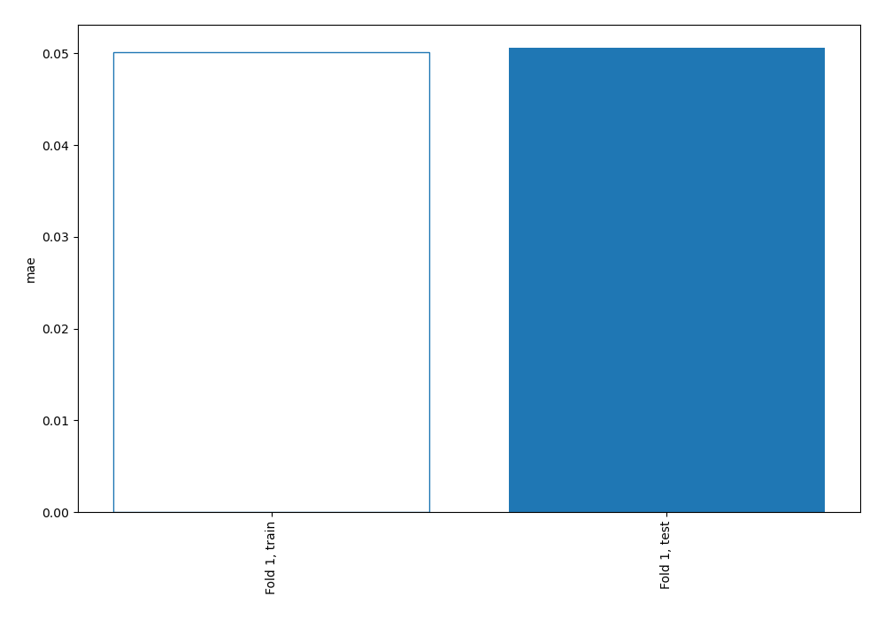
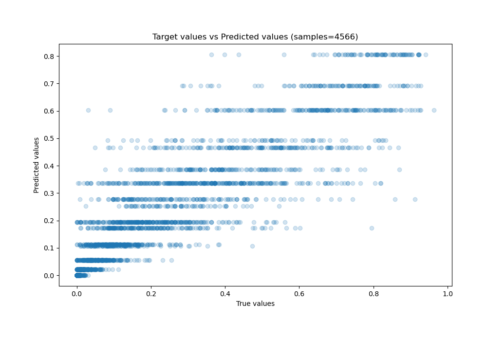
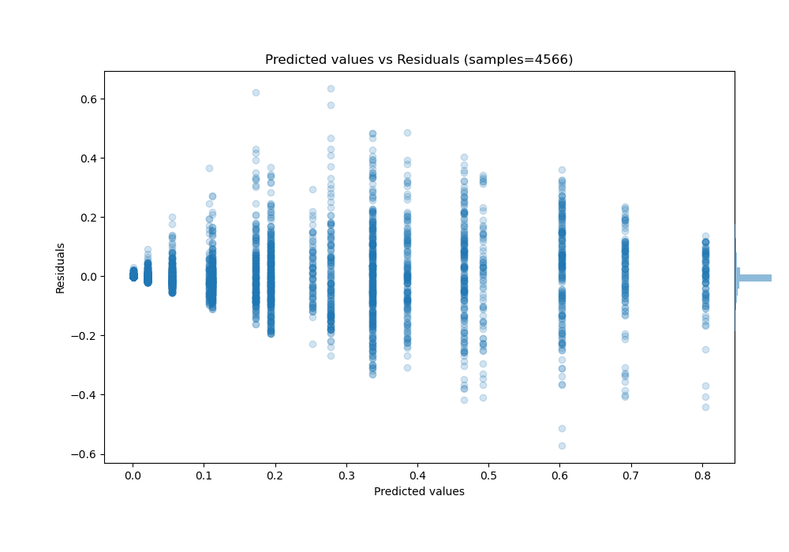

# Summary of 1_DecisionTree

[<< Go back](../README.md)

## Decision Tree
- **n_jobs**: -1
- **criterion**: friedman_mse
- **max_depth**: 4
- **explain_level**: 0

## Validation
 - **validation_type**: split
 - **train_ratio**: 0.9
 - **shuffle**: True

## Optimized metric
mae

## Training time

1.4 seconds

### Metric details:
| Metric   |       Score |
|:---------|------------:|
| MAE      | 0.0506184   |
| MSE      | 0.00887561  |
| RMSE     | 0.0942105   |
| R2       | 0.837733    |
| MAPE     | 2.36713e+12 |

## Learning curves

## True vs Predicted

## Predicted vs Residuals

[<< Go back](../README.md)
