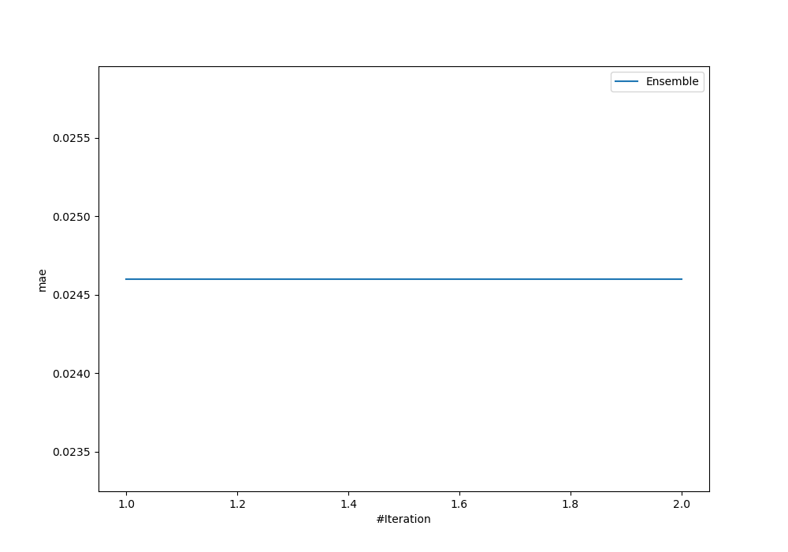
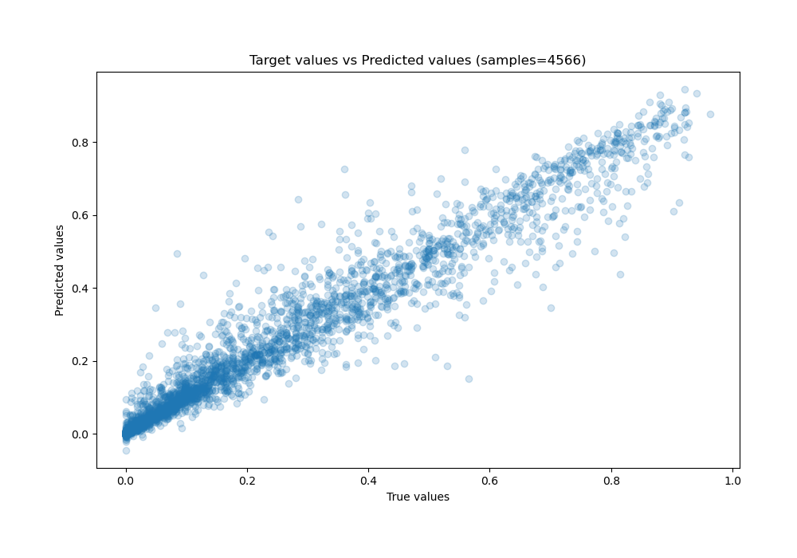
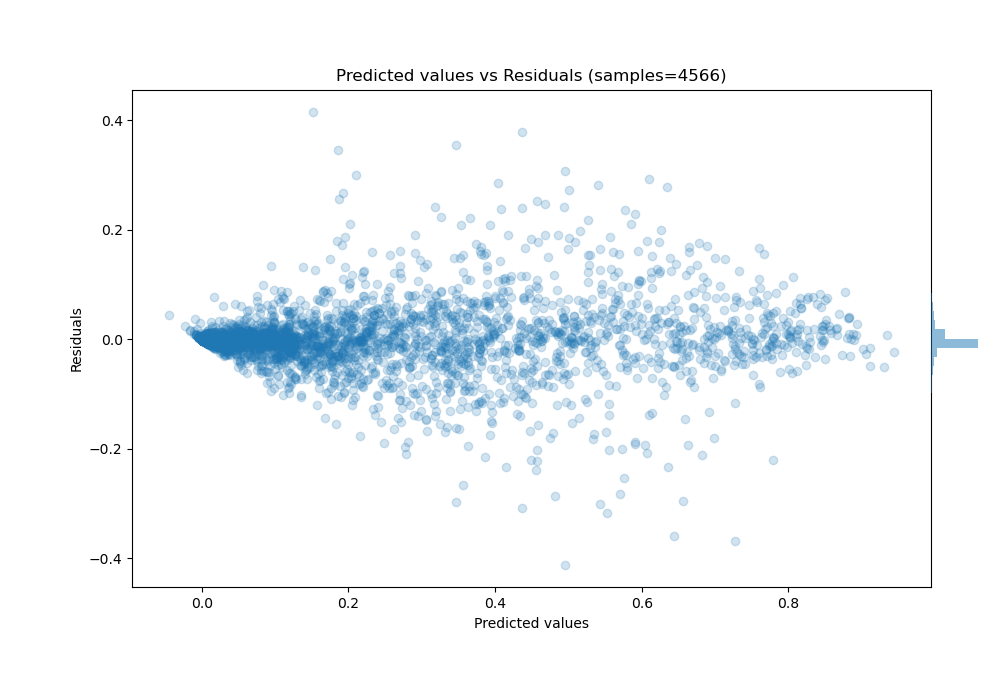

# Summary of Ensemble

[<< Go back](../README.md)

## Ensemble structure
| Model              |   Weight |
|:-------------------|---------:|
| 2_Default_LightGBM |        1 |

### Metric details:
| Metric   |       Score |
|:---------|------------:|
| MAE      | 0.0246017   |
| MSE      | 0.00250071  |
| RMSE     | 0.0500071   |
| R2       | 0.954281    |
| MAPE     | 1.99181e+12 |

## Learning curves

## True vs Predicted

## Predicted vs Residuals

[<< Go back](../README.md)
