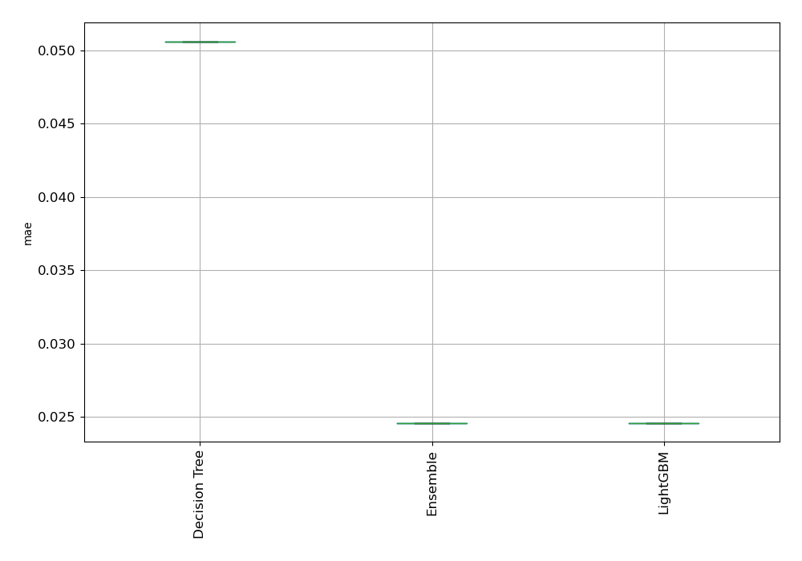
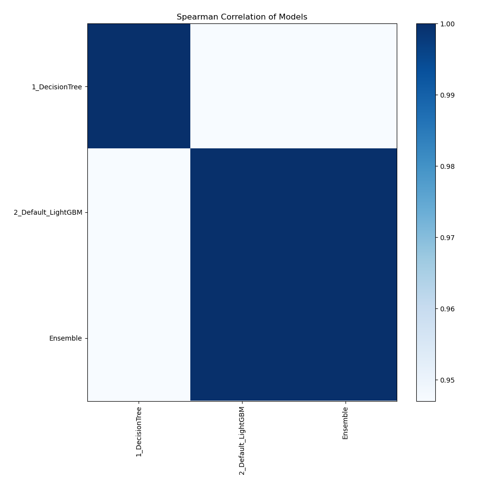

# AutoML Leaderboard

| Best model   | name                                               | model_type    | metric_type   |   metric_value |   train_time |
|:-------------|:---------------------------------------------------|:--------------|:--------------|---------------:|-------------:|
|              | [1_DecisionTree](1_DecisionTree/README.md)         | Decision Tree | mae           |      0.0506184 |         1.58 |
| **the best** | [2_Default_LightGBM](2_Default_LightGBM/README.md) | LightGBM      | mae           |      0.0246017 |        95.09 |
|              | [Ensemble](Ensemble/README.md)                     | Ensemble      | mae           |      0.0246017 |         0.05 |

### AutoML Performance

### AutoML Performance Boxplot

### Spearman Correlation of Models

