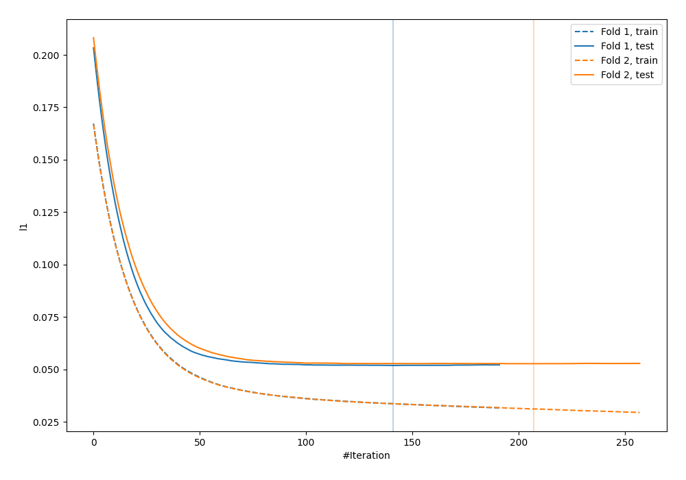
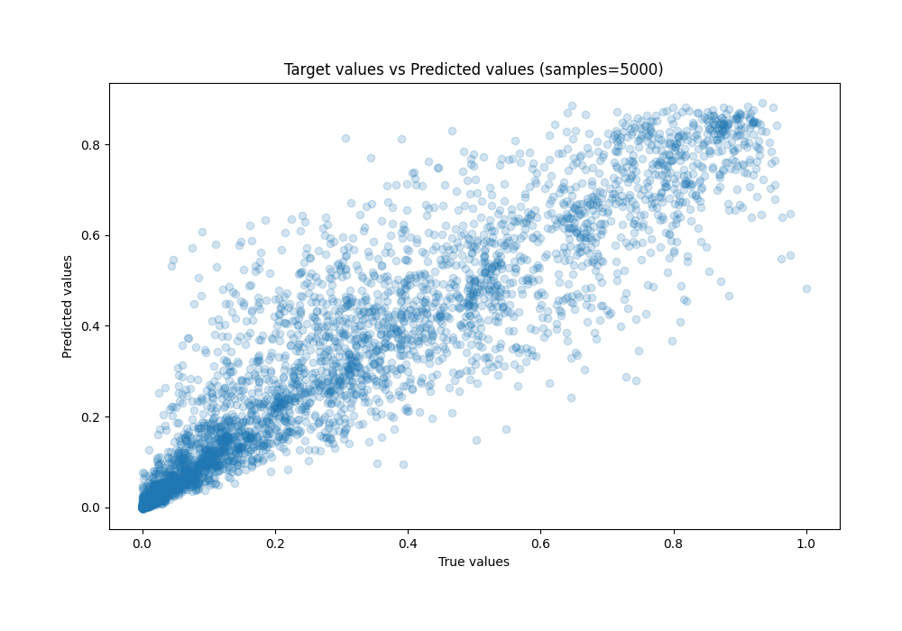
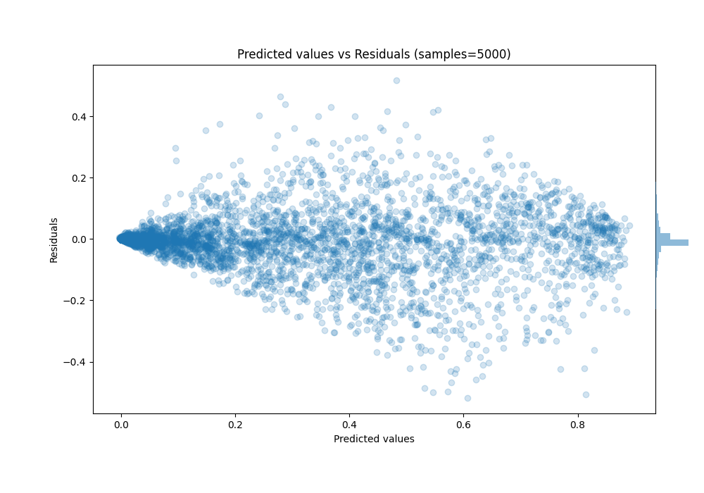

# Summary of 15_LightGBM

[<< Go back](../README.md)

## LightGBM
- **n_jobs**: -1
- **objective**: regression
- **num_leaves**: 31
- **learning_rate**: 0.05
- **feature_fraction**: 0.9
- **bagging_fraction**: 0.9
- **min_data_in_leaf**: 20
- **metric**: l1
- **custom_eval_metric_name**: None
- **explain_level**: 0

## Validation
 - **validation_type**: custom

## Optimized metric
mae

## Training time

10.4 seconds

### Metric details:
| Metric   |       Score |
|:---------|------------:|
| MAE      | 0.0523339   |
| MSE      | 0.00830077  |
| RMSE     | 0.0911085   |
| R2       | 0.88846     |
| MAPE     | 1.45868e+12 |

## Learning curves

## True vs Predicted

## Predicted vs Residuals

[<< Go back](../README.md)
