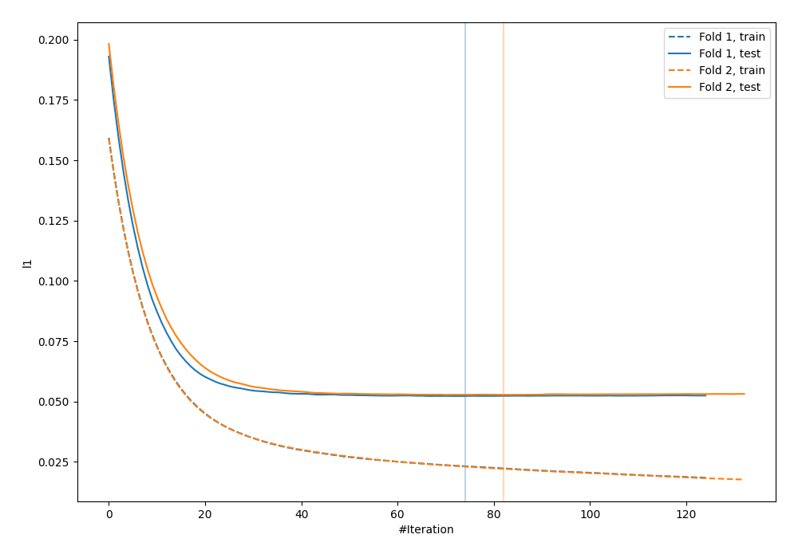
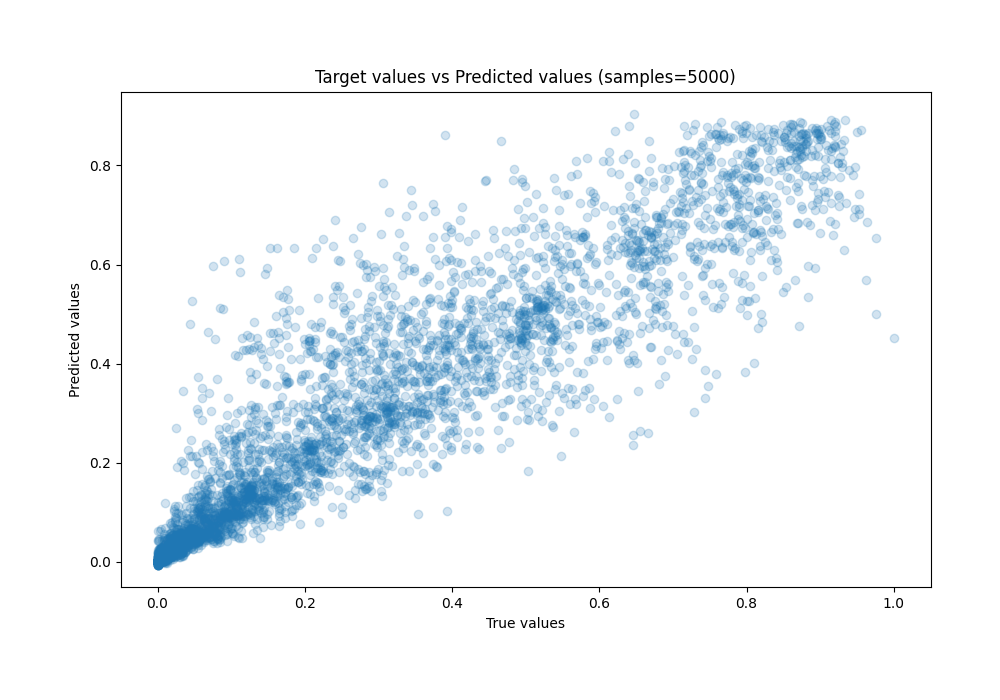
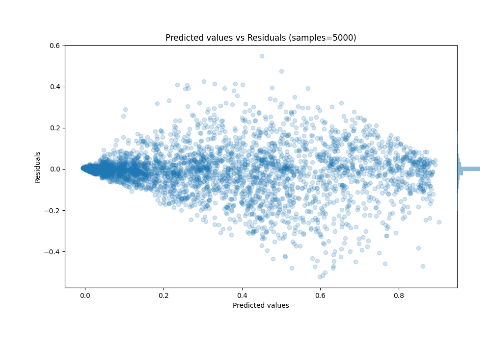

# Summary of 20_LightGBM

[<< Go back](../README.md)

## LightGBM
- **n_jobs**: -1
- **objective**: regression
- **num_leaves**: 95
- **learning_rate**: 0.1
- **feature_fraction**: 1.0
- **bagging_fraction**: 0.5
- **min_data_in_leaf**: 10
- **metric**: l1
- **custom_eval_metric_name**: None
- **explain_level**: 0

## Validation
 - **validation_type**: custom

## Optimized metric
mae

## Training time

11.4 seconds

### Metric details:
| Metric   |       Score |
|:---------|------------:|
| MAE      | 0.0524964   |
| MSE      | 0.00855396  |
| RMSE     | 0.0924876   |
| R2       | 0.885058    |
| MAPE     | 9.58424e+11 |

## Learning curves

## True vs Predicted

## Predicted vs Residuals

[<< Go back](../README.md)
