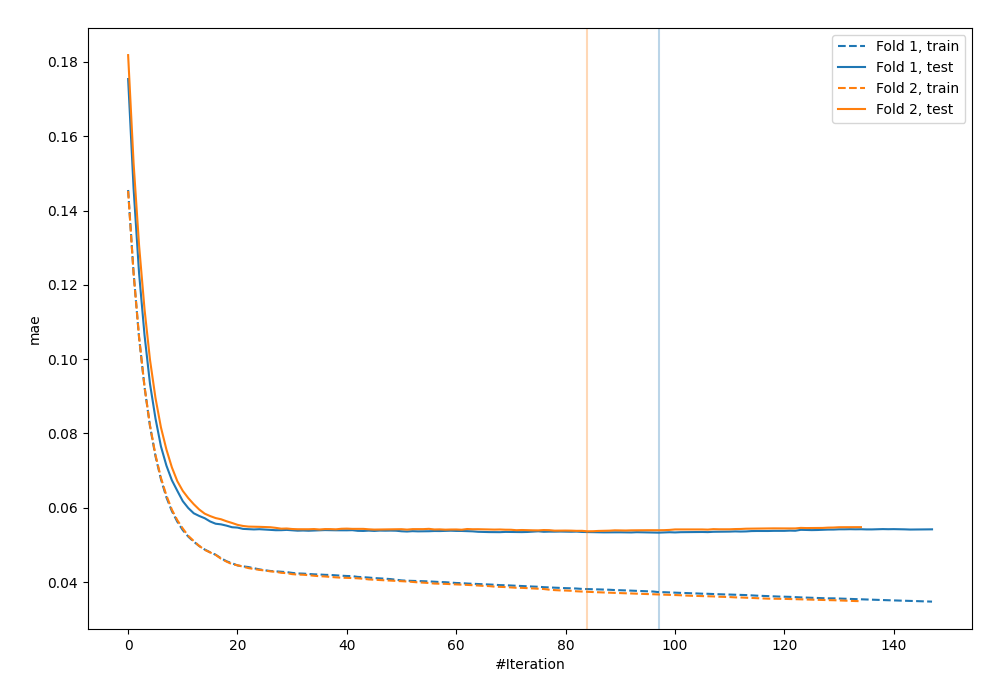
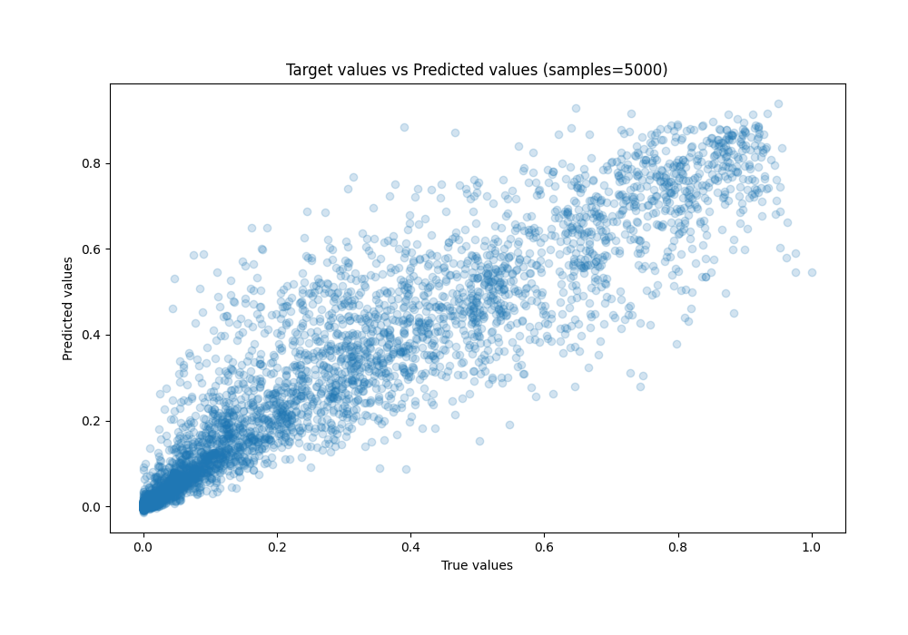
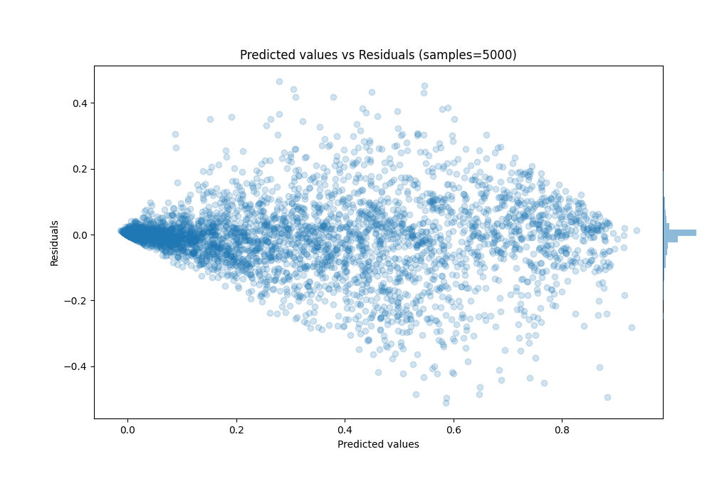

# Summary of 23_CatBoost

[<< Go back](../README.md)

## CatBoost
- **n_jobs**: -1
- **learning_rate**: 0.2
- **depth**: 6
- **rsm**: 0.8
- **loss_function**: RMSE
- **eval_metric**: MAE
- **explain_level**: 0

## Validation
 - **validation_type**: custom

## Optimized metric
mae

## Training time

13.3 seconds

### Metric details:
| Metric   |       Score |
|:---------|------------:|
| MAE      | 0.0534917   |
| MSE      | 0.00836803  |
| RMSE     | 0.0914769   |
| R2       | 0.887556    |
| MAPE     | 2.76116e+12 |

## Learning curves

## True vs Predicted

## Predicted vs Residuals

[<< Go back](../README.md)
