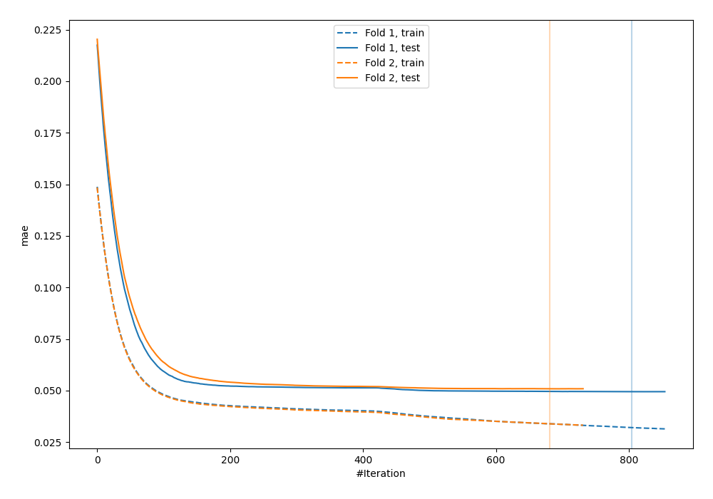
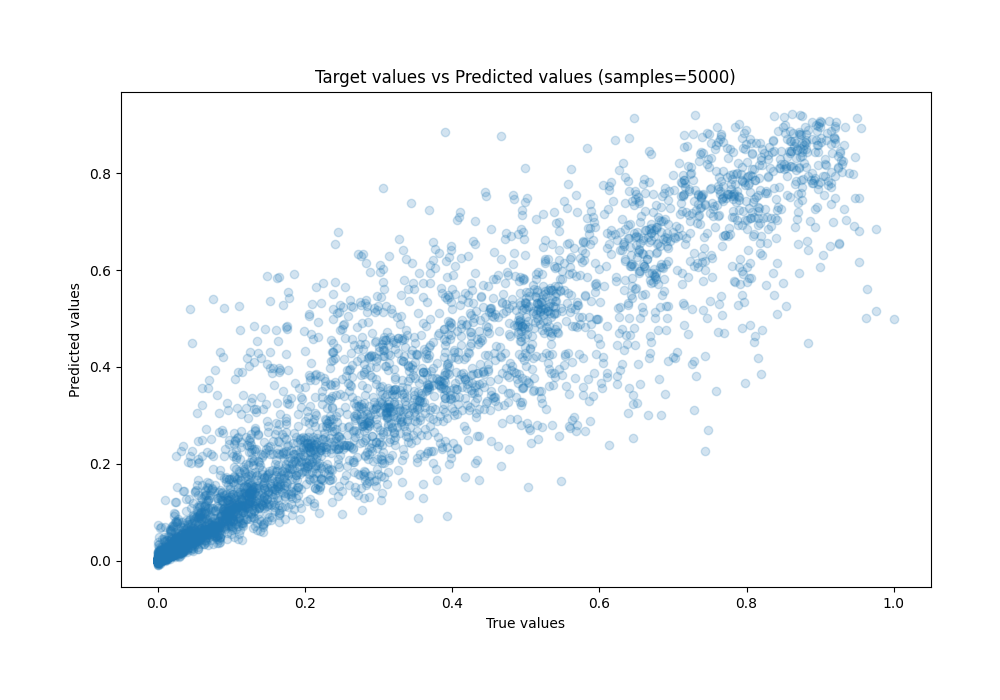
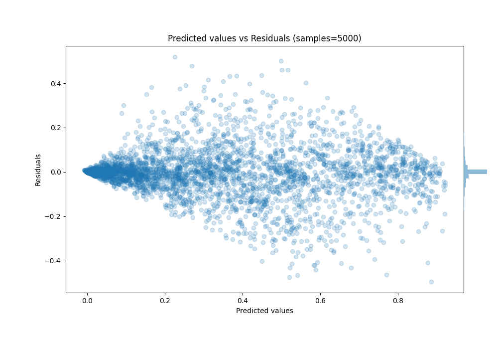

# Summary of 31_CatBoost

[<< Go back](../README.md)

## CatBoost
- **n_jobs**: -1
- **learning_rate**: 0.025
- **depth**: 9
- **rsm**: 0.9
- **loss_function**: MAE
- **eval_metric**: MAE
- **explain_level**: 0

## Validation
 - **validation_type**: custom

## Optimized metric
mae

## Training time

170.2 seconds

### Metric details:
| Metric   |       Score |
|:---------|------------:|
| MAE      | 0.0501269   |
| MSE      | 0.00797978  |
| RMSE     | 0.0893296   |
| R2       | 0.892773    |
| MAPE     | 7.02811e+11 |

## Learning curves

## True vs Predicted

## Predicted vs Residuals

[<< Go back](../README.md)
