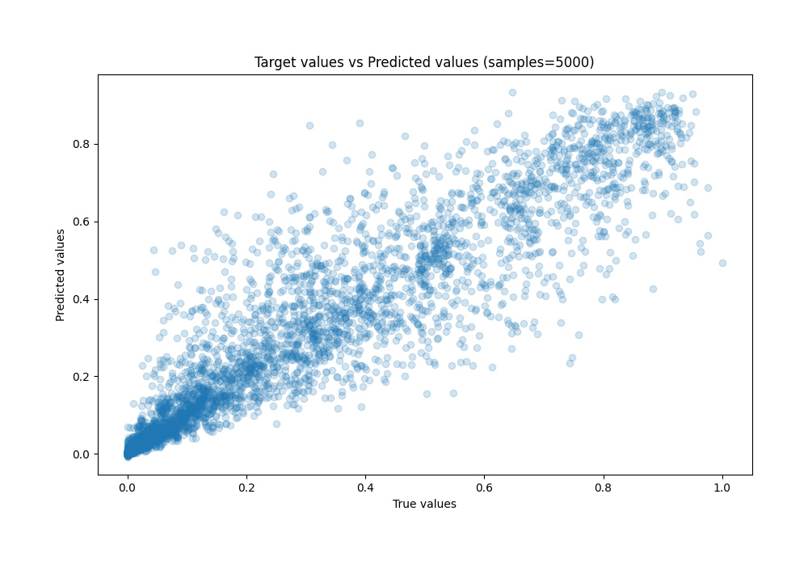

# Summary of 36_CatBoost

[<< Go back](../README.md)

## CatBoost
- **n_jobs**: -1
- **learning_rate**: 0.1
- **depth**: 5
- **rsm**: 0.8
- **loss_function**: MAE
- **eval_metric**: MAE
- **explain_level**: 0

## Validation
 - **validation_type**: custom

## Optimized metric
mae

## Training time

32.8 seconds

### Metric details:
| Metric   |       Score |
|:---------|------------:|
| MAE      | 0.0508764   |
| MSE      | 0.00820527  |
| RMSE     | 0.090583    |
| R2       | 0.889743    |
| MAPE     | 7.98281e+11 |

## Learning curves

## True vs Predicted

## Predicted vs Residuals

[<< Go back](../README.md)
