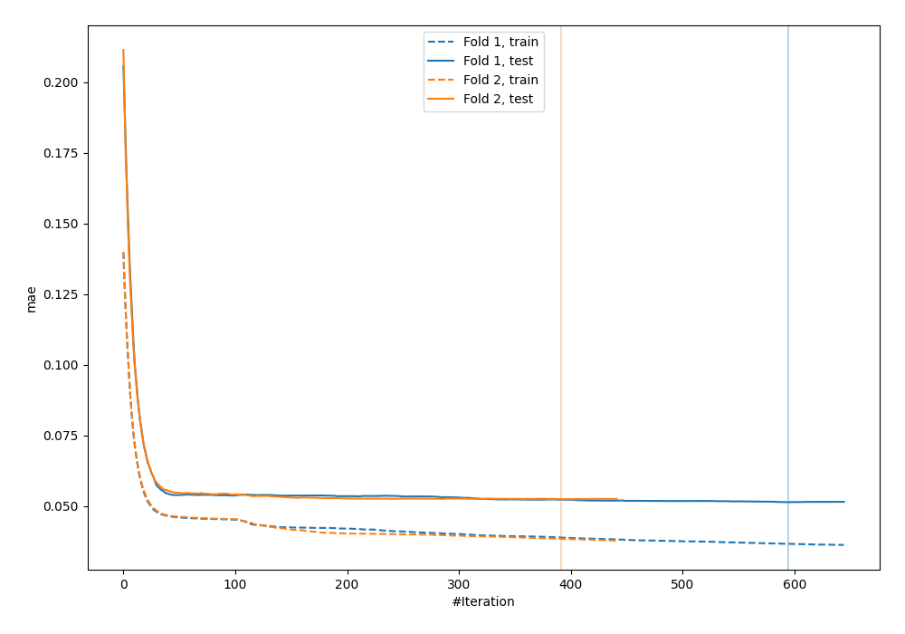
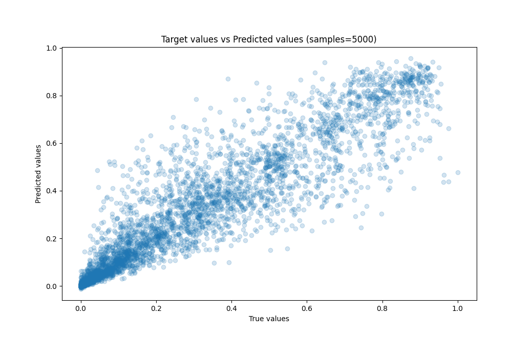
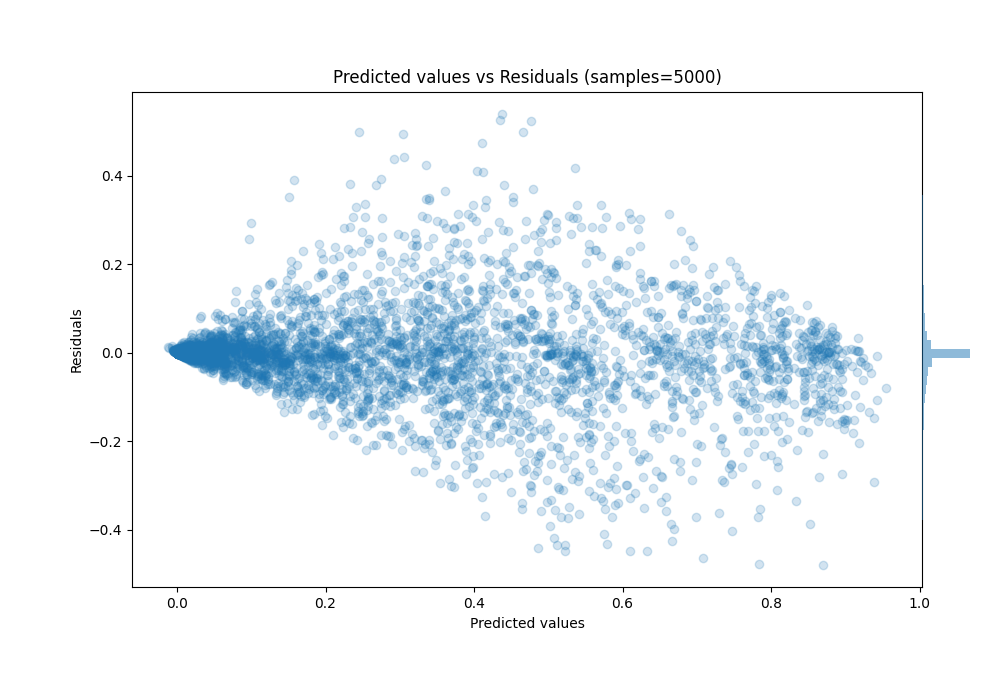

# Summary of 36_CatBoost_Stacked

[<< Go back](../README.md)

## CatBoost
- **n_jobs**: -1
- **learning_rate**: 0.1
- **depth**: 5
- **rsm**: 0.8
- **loss_function**: MAE
- **eval_metric**: MAE
- **explain_level**: 0

## Validation
 - **validation_type**: custom

## Optimized metric
mae

## Training time

45.7 seconds

### Metric details:
| Metric   |       Score |
|:---------|------------:|
| MAE      | 0.0519648   |
| MSE      | 0.00855582  |
| RMSE     | 0.0924977   |
| R2       | 0.885033    |
| MAPE     | 9.35387e+11 |

## Learning curves

## True vs Predicted

## Predicted vs Residuals

[<< Go back](../README.md)
