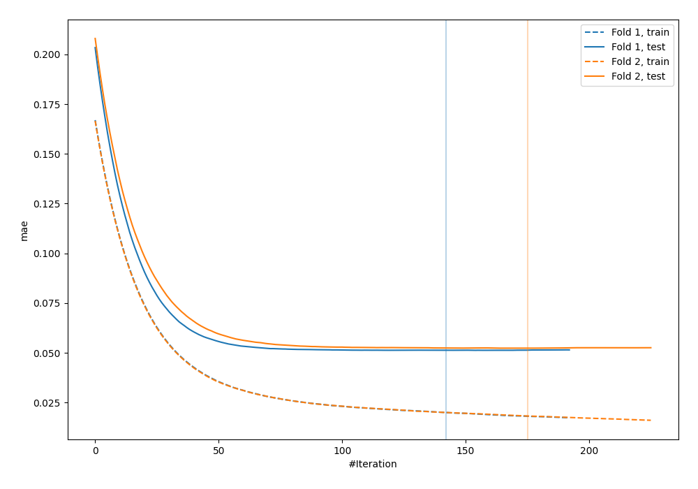
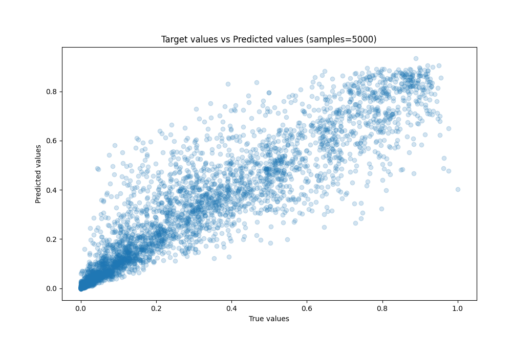
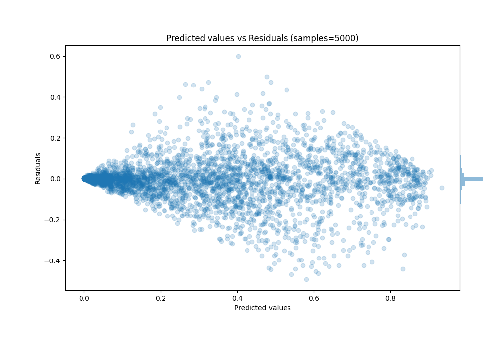

# Summary of 37_Xgboost_Stacked

[<< Go back](../README.md)

## Extreme Gradient Boosting (Xgboost)
- **n_jobs**: -1
- **objective**: reg:squarederror
- **eta**: 0.05
- **max_depth**: 9
- **min_child_weight**: 10
- **subsample**: 0.7
- **colsample_bytree**: 0.6
- **eval_metric**: mae
- **explain_level**: 0

## Validation
 - **validation_type**: custom

## Optimized metric
mae

## Training time

23.2 seconds

### Metric details:
| Metric   |      Score |
|:---------|-----------:|
| MAE      | 0.0517585  |
| MSE      | 0.00839624 |
| RMSE     | 0.091631   |
| R2       | 0.887177   |
| MAPE     | 8.3103e+11 |

## Learning curves

## True vs Predicted

## Predicted vs Residuals

[<< Go back](../README.md)
