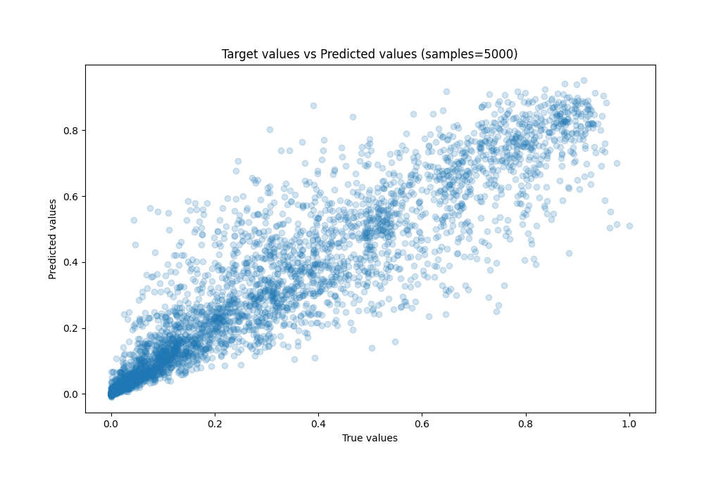

# Summary of 50_CatBoost

[<< Go back](../README.md)

## CatBoost
- **n_jobs**: -1
- **learning_rate**: 0.025
- **depth**: 9
- **rsm**: 1
- **loss_function**: MAPE
- **eval_metric**: MAE
- **explain_level**: 0

## Validation
 - **validation_type**: custom

## Optimized metric
mae

## Training time

140.5 seconds

### Metric details:
| Metric   |       Score |
|:---------|------------:|
| MAE      | 0.0506263   |
| MSE      | 0.00805214  |
| RMSE     | 0.0897337   |
| R2       | 0.891801    |
| MAPE     | 7.41952e+11 |

## Learning curves

## True vs Predicted

## Predicted vs Residuals

[<< Go back](../README.md)
