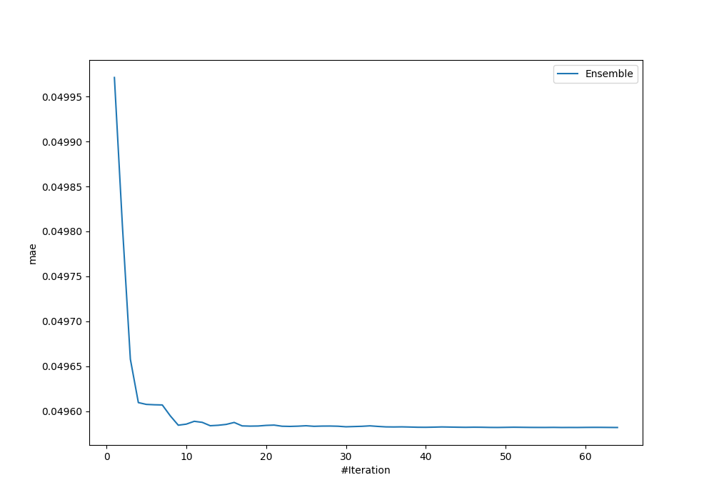
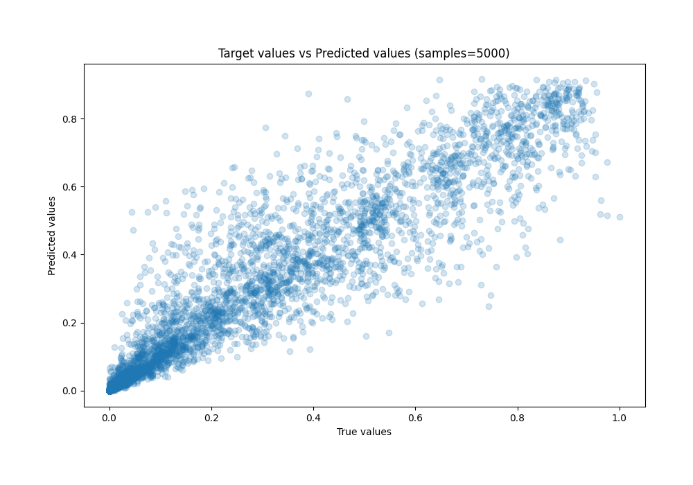
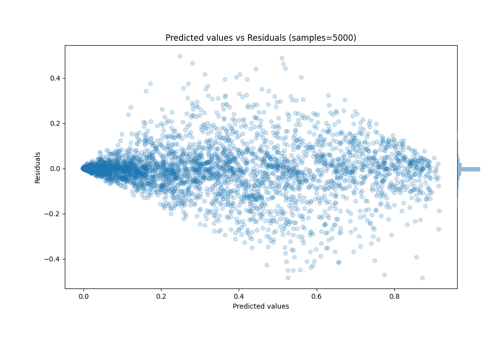

# Summary of Ensemble

[<< Go back](../README.md)

## Ensemble structure
| Model       |   Weight |
|:------------|---------:|
| 31_CatBoost |        8 |
| 32_CatBoost |       14 |
| 36_CatBoost |        7 |
| 38_Xgboost  |       13 |
| 45_CatBoost |       16 |
| 47_CatBoost |        5 |
| 54_Xgboost  |        1 |

### Metric details:
| Metric   |       Score |
|:---------|------------:|
| MAE      | 0.0495817   |
| MSE      | 0.00779782  |
| RMSE     | 0.0883053   |
| R2       | 0.895218    |
| MAPE     | 5.71262e+11 |

## Learning curves

## True vs Predicted

## Predicted vs Residuals

[<< Go back](../README.md)
