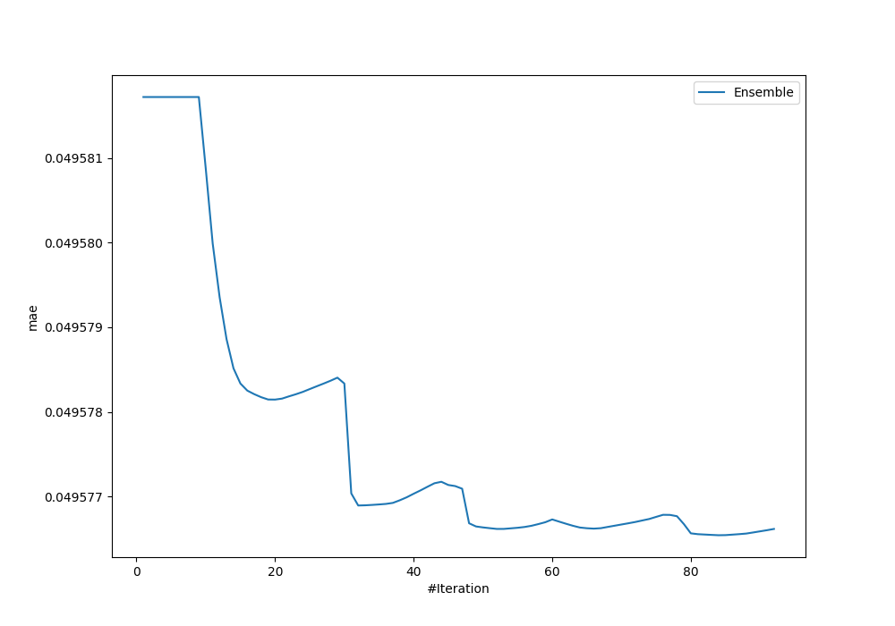
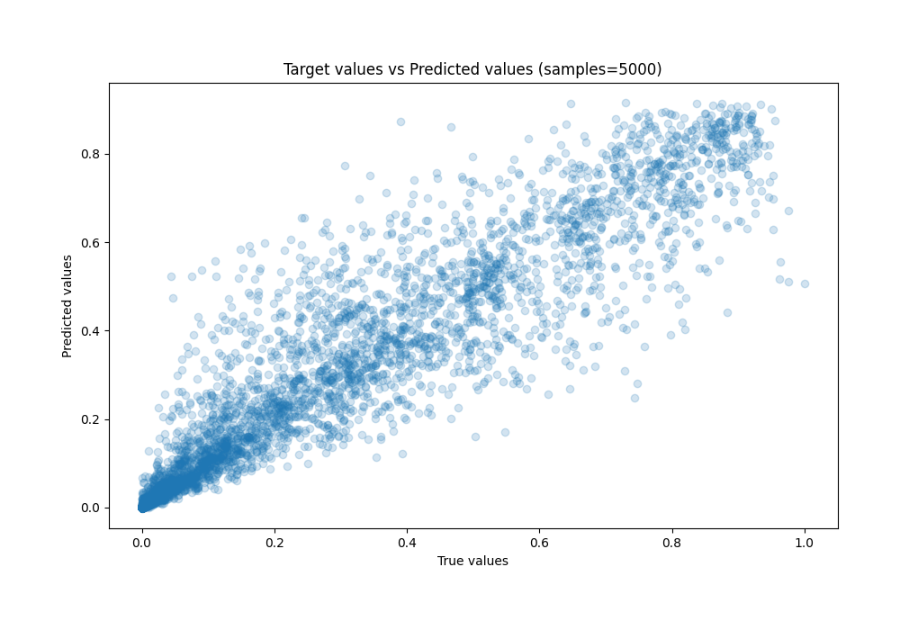
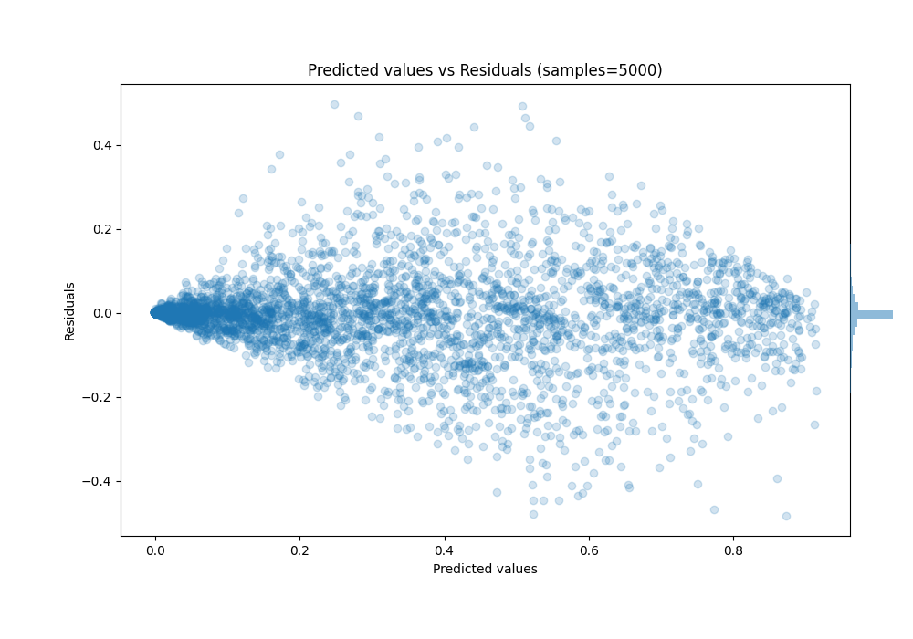

# Summary of Ensemble_Stacked

[<< Go back](../README.md)

## Ensemble structure
| Model               |   Weight |
|:--------------------|---------:|
| 32_CatBoost         |        2 |
| 38_Xgboost          |        3 |
| 45_CatBoost         |        2 |
| 46_CatBoost_Stacked |        5 |
| Ensemble            |       72 |

### Metric details:
| Metric   |       Score |
|:---------|------------:|
| MAE      | 0.0495765   |
| MSE      | 0.00780117  |
| RMSE     | 0.0883242   |
| R2       | 0.895173    |
| MAPE     | 5.62366e+11 |

## Learning curves

## True vs Predicted

## Predicted vs Residuals

[<< Go back](../README.md)
