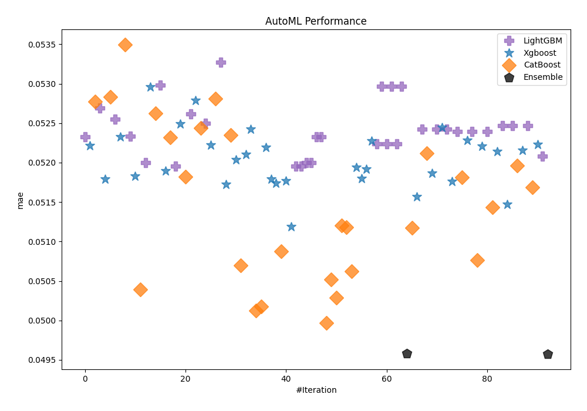
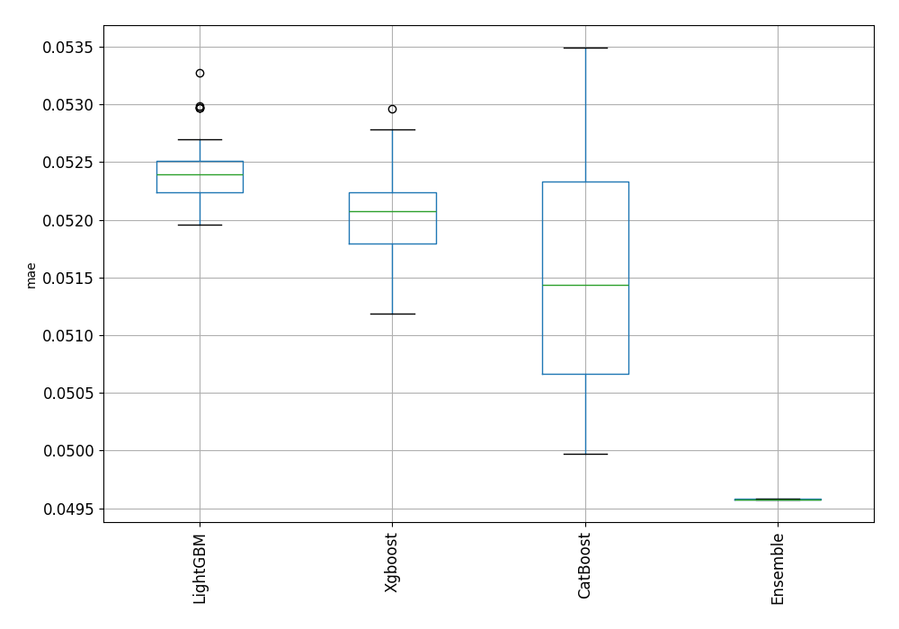
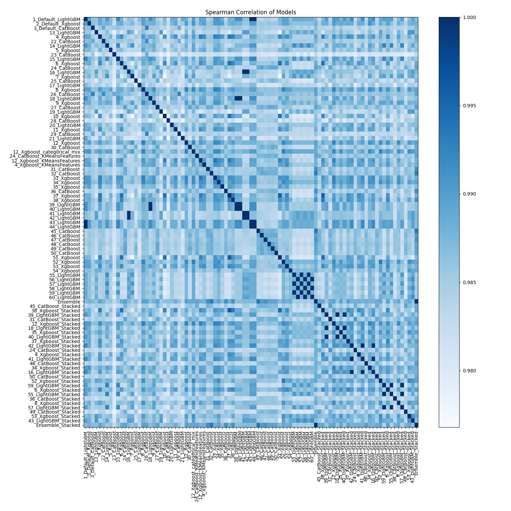

# AutoML Leaderboard

| Best model   | name                                                               | model_type   | metric_type   |   metric_value |   train_time |
|:-------------|:-------------------------------------------------------------------|:-------------|:--------------|---------------:|-------------:|
|              | [1_Default_LightGBM](1_Default_LightGBM/README.md)                 | LightGBM     | mae           |      0.0523298 |        13.3  |
|              | [2_Default_Xgboost](2_Default_Xgboost/README.md)                   | Xgboost      | mae           |      0.0522144 |        11.48 |
|              | [3_Default_CatBoost](3_Default_CatBoost/README.md)                 | CatBoost     | mae           |      0.0527766 |        12.31 |
|              | [13_LightGBM](13_LightGBM/README.md)                               | LightGBM     | mae           |      0.0526941 |        10.37 |
|              | [4_Xgboost](4_Xgboost/README.md)                                   | Xgboost      | mae           |      0.0517879 |         9.95 |
|              | [22_CatBoost](22_CatBoost/README.md)                               | CatBoost     | mae           |      0.052833  |        19.69 |
|              | [14_LightGBM](14_LightGBM/README.md)                               | LightGBM     | mae           |      0.0525464 |         9.43 |
|              | [5_Xgboost](5_Xgboost/README.md)                                   | Xgboost      | mae           |      0.0523242 |         7.59 |
|              | [23_CatBoost](23_CatBoost/README.md)                               | CatBoost     | mae           |      0.0534917 |        13.87 |
|              | [15_LightGBM](15_LightGBM/README.md)                               | LightGBM     | mae           |      0.0523339 |        10.95 |
|              | [6_Xgboost](6_Xgboost/README.md)                                   | Xgboost      | mae           |      0.0518303 |        19.94 |
|              | [24_CatBoost](24_CatBoost/README.md)                               | CatBoost     | mae           |      0.0503942 |       237.01 |
|              | [16_LightGBM](16_LightGBM/README.md)                               | LightGBM     | mae           |      0.0520027 |        16.23 |
|              | [7_Xgboost](7_Xgboost/README.md)                                   | Xgboost      | mae           |      0.0529583 |         7.76 |
|              | [25_CatBoost](25_CatBoost/README.md)                               | CatBoost     | mae           |      0.0526228 |        20.84 |
|              | [17_LightGBM](17_LightGBM/README.md)                               | LightGBM     | mae           |      0.0529822 |         9.2  |
|              | [8_Xgboost](8_Xgboost/README.md)                                   | Xgboost      | mae           |      0.0518987 |        10.61 |
|              | [26_CatBoost](26_CatBoost/README.md)                               | CatBoost     | mae           |      0.0523164 |        59.85 |
|              | [18_LightGBM](18_LightGBM/README.md)                               | LightGBM     | mae           |      0.0519583 |        10.69 |
|              | [9_Xgboost](9_Xgboost/README.md)                                   | Xgboost      | mae           |      0.0524927 |         8.06 |
|              | [27_CatBoost](27_CatBoost/README.md)                               | CatBoost     | mae           |      0.0518238 |        33.73 |
|              | [19_LightGBM](19_LightGBM/README.md)                               | LightGBM     | mae           |      0.0526134 |        12.64 |
|              | [10_Xgboost](10_Xgboost/README.md)                                 | Xgboost      | mae           |      0.0527863 |         9.18 |
|              | [28_CatBoost](28_CatBoost/README.md)                               | CatBoost     | mae           |      0.0524412 |        17.24 |
|              | [20_LightGBM](20_LightGBM/README.md)                               | LightGBM     | mae           |      0.0524964 |        11.98 |
|              | [11_Xgboost](11_Xgboost/README.md)                                 | Xgboost      | mae           |      0.0522231 |        12.67 |
|              | [29_CatBoost](29_CatBoost/README.md)                               | CatBoost     | mae           |      0.0528086 |        19.83 |
|              | [21_LightGBM](21_LightGBM/README.md)                               | LightGBM     | mae           |      0.0532751 |         9.7  |
|              | [12_Xgboost](12_Xgboost/README.md)                                 | Xgboost      | mae           |      0.0517261 |        11.5  |
|              | [30_CatBoost](30_CatBoost/README.md)                               | CatBoost     | mae           |      0.0523506 |        52.63 |
|              | [12_Xgboost_categorical_mix](12_Xgboost_categorical_mix/README.md) | Xgboost      | mae           |      0.0520359 |         8.93 |
|              | [24_CatBoost_KMeansFeatures](24_CatBoost_KMeansFeatures/README.md) | CatBoost     | mae           |      0.0506973 |       209.6  |
|              | [12_Xgboost_KMeansFeatures](12_Xgboost_KMeansFeatures/README.md)   | Xgboost      | mae           |      0.0521065 |        14.99 |
|              | [4_Xgboost_KMeansFeatures](4_Xgboost_KMeansFeatures/README.md)     | Xgboost      | mae           |      0.052421  |        14.91 |
|              | [31_CatBoost](31_CatBoost/README.md)                               | CatBoost     | mae           |      0.0501269 |       170.83 |
|              | [32_CatBoost](32_CatBoost/README.md)                               | CatBoost     | mae           |      0.0501738 |       192.87 |
|              | [33_Xgboost](33_Xgboost/README.md)                                 | Xgboost      | mae           |      0.0521929 |        11.81 |
|              | [34_Xgboost](34_Xgboost/README.md)                                 | Xgboost      | mae           |      0.0517943 |        13.25 |
|              | [35_Xgboost](35_Xgboost/README.md)                                 | Xgboost      | mae           |      0.0517401 |        10.83 |
|              | [36_CatBoost](36_CatBoost/README.md)                               | CatBoost     | mae           |      0.0508764 |        33.34 |
|              | [37_Xgboost](37_Xgboost/README.md)                                 | Xgboost      | mae           |      0.0517705 |        17.15 |
|              | [38_Xgboost](38_Xgboost/README.md)                                 | Xgboost      | mae           |      0.0511896 |        20.36 |
|              | [39_LightGBM](39_LightGBM/README.md)                               | LightGBM     | mae           |      0.0519583 |        11.27 |
|              | [40_LightGBM](40_LightGBM/README.md)                               | LightGBM     | mae           |      0.0519583 |        11.18 |
|              | [41_LightGBM](41_LightGBM/README.md)                               | LightGBM     | mae           |      0.0520027 |        16.43 |
|              | [42_LightGBM](42_LightGBM/README.md)                               | LightGBM     | mae           |      0.0520027 |        16.35 |
|              | [43_LightGBM](43_LightGBM/README.md)                               | LightGBM     | mae           |      0.0523298 |        13.31 |
|              | [44_LightGBM](44_LightGBM/README.md)                               | LightGBM     | mae           |      0.0523298 |        13.28 |
|              | [45_CatBoost](45_CatBoost/README.md)                               | CatBoost     | mae           |      0.0499713 |       213.66 |
|              | [46_CatBoost](46_CatBoost/README.md)                               | CatBoost     | mae           |      0.0505197 |       107    |
|              | [47_CatBoost](47_CatBoost/README.md)                               | CatBoost     | mae           |      0.0502911 |       269.34 |
|              | [48_CatBoost](48_CatBoost/README.md)                               | CatBoost     | mae           |      0.0512065 |       109.2  |
|              | [49_CatBoost](49_CatBoost/README.md)                               | CatBoost     | mae           |      0.0511825 |       151.5  |
|              | [50_CatBoost](50_CatBoost/README.md)                               | CatBoost     | mae           |      0.0506263 |       141.13 |
|              | [51_Xgboost](51_Xgboost/README.md)                                 | Xgboost      | mae           |      0.0519377 |        15.8  |
|              | [52_Xgboost](52_Xgboost/README.md)                                 | Xgboost      | mae           |      0.051797  |        10.8  |
|              | [53_Xgboost](53_Xgboost/README.md)                                 | Xgboost      | mae           |      0.0519202 |        12.14 |
|              | [54_Xgboost](54_Xgboost/README.md)                                 | Xgboost      | mae           |      0.0522746 |        10.11 |
|              | [55_LightGBM](55_LightGBM/README.md)                               | LightGBM     | mae           |      0.0522409 |        10.59 |
|              | [56_LightGBM](56_LightGBM/README.md)                               | LightGBM     | mae           |      0.0529665 |        11.84 |
|              | [57_LightGBM](57_LightGBM/README.md)                               | LightGBM     | mae           |      0.0522409 |        10.41 |
|              | [58_LightGBM](58_LightGBM/README.md)                               | LightGBM     | mae           |      0.0529665 |        12.01 |
|              | [59_LightGBM](59_LightGBM/README.md)                               | LightGBM     | mae           |      0.0522409 |        10.32 |
|              | [60_LightGBM](60_LightGBM/README.md)                               | LightGBM     | mae           |      0.0529665 |        12.22 |
|              | [Ensemble](Ensemble/README.md)                                     | Ensemble     | mae           |      0.0495817 |         9.73 |
|              | [45_CatBoost_Stacked](45_CatBoost_Stacked/README.md)               | CatBoost     | mae           |      0.0511705 |       156.96 |
|              | [38_Xgboost_Stacked](38_Xgboost_Stacked/README.md)                 | Xgboost      | mae           |      0.0515656 |        23.09 |
|              | [39_LightGBM_Stacked](39_LightGBM_Stacked/README.md)               | LightGBM     | mae           |      0.0524199 |        13.94 |
|              | [31_CatBoost_Stacked](31_CatBoost_Stacked/README.md)               | CatBoost     | mae           |      0.0521204 |        93.69 |
|              | [12_Xgboost_Stacked](12_Xgboost_Stacked/README.md)                 | Xgboost      | mae           |      0.0518691 |        14.01 |
|              | [18_LightGBM_Stacked](18_LightGBM_Stacked/README.md)               | LightGBM     | mae           |      0.0524199 |        13.71 |
|              | [35_Xgboost_Stacked](35_Xgboost_Stacked/README.md)                 | Xgboost      | mae           |      0.0524441 |        13.05 |
|              | [40_LightGBM_Stacked](40_LightGBM_Stacked/README.md)               | LightGBM     | mae           |      0.0524199 |        13.68 |
|              | [37_Xgboost_Stacked](37_Xgboost_Stacked/README.md)                 | Xgboost      | mae           |      0.0517585 |        23.73 |
|              | [42_LightGBM_Stacked](42_LightGBM_Stacked/README.md)               | LightGBM     | mae           |      0.0523914 |        18.24 |
|              | [24_CatBoost_Stacked](24_CatBoost_Stacked/README.md)               | CatBoost     | mae           |      0.0518136 |       129.05 |
|              | [4_Xgboost_Stacked](4_Xgboost_Stacked/README.md)                   | Xgboost      | mae           |      0.05228   |        12.46 |
|              | [41_LightGBM_Stacked](41_LightGBM_Stacked/README.md)               | LightGBM     | mae           |      0.0523914 |        18.89 |
|              | [46_CatBoost_Stacked](46_CatBoost_Stacked/README.md)               | CatBoost     | mae           |      0.0507621 |       160.03 |
|              | [34_Xgboost_Stacked](34_Xgboost_Stacked/README.md)                 | Xgboost      | mae           |      0.0522086 |        17.38 |
|              | [16_LightGBM_Stacked](16_LightGBM_Stacked/README.md)               | LightGBM     | mae           |      0.0523914 |        18.5  |
|              | [50_CatBoost_Stacked](50_CatBoost_Stacked/README.md)               | CatBoost     | mae           |      0.0514366 |       130.92 |
|              | [52_Xgboost_Stacked](52_Xgboost_Stacked/README.md)                 | Xgboost      | mae           |      0.05214   |        12.69 |
|              | [59_LightGBM_Stacked](59_LightGBM_Stacked/README.md)               | LightGBM     | mae           |      0.0524671 |        11.83 |
|              | [6_Xgboost_Stacked](6_Xgboost_Stacked/README.md)                   | Xgboost      | mae           |      0.0514717 |        24.33 |
|              | [55_LightGBM_Stacked](55_LightGBM_Stacked/README.md)               | LightGBM     | mae           |      0.0524671 |        11.93 |
|              | [36_CatBoost_Stacked](36_CatBoost_Stacked/README.md)               | CatBoost     | mae           |      0.0519648 |        46.24 |
|              | [8_Xgboost_Stacked](8_Xgboost_Stacked/README.md)                   | Xgboost      | mae           |      0.0521583 |        14.03 |
|              | [57_LightGBM_Stacked](57_LightGBM_Stacked/README.md)               | LightGBM     | mae           |      0.0524671 |        11.89 |
|              | [49_CatBoost_Stacked](49_CatBoost_Stacked/README.md)               | CatBoost     | mae           |      0.0516841 |       149.69 |
|              | [53_Xgboost_Stacked](53_Xgboost_Stacked/README.md)                 | Xgboost      | mae           |      0.0522268 |        14.89 |
|              | [43_LightGBM_Stacked](43_LightGBM_Stacked/README.md)               | LightGBM     | mae           |      0.0520815 |        16.24 |
| **the best** | [Ensemble_Stacked](Ensemble_Stacked/README.md)                     | Ensemble     | mae           |      0.0495765 |        19.78 |

### AutoML Performance

### AutoML Performance Boxplot

### Spearman Correlation of Models

