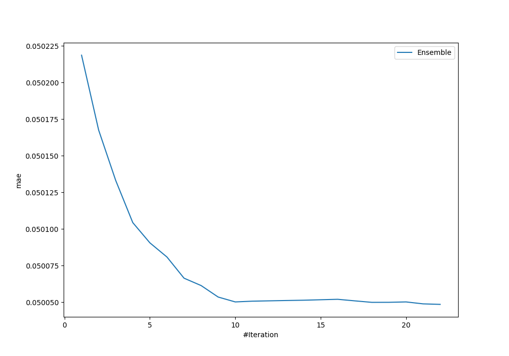
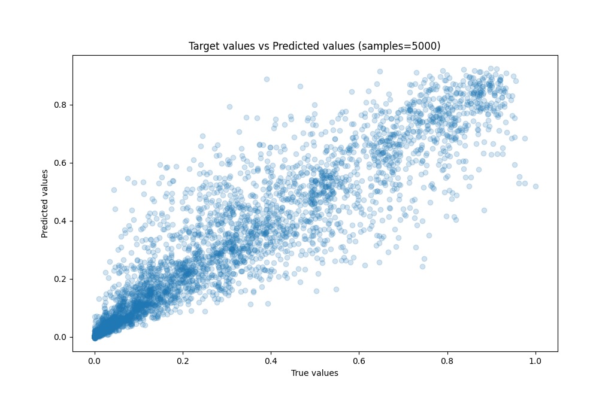
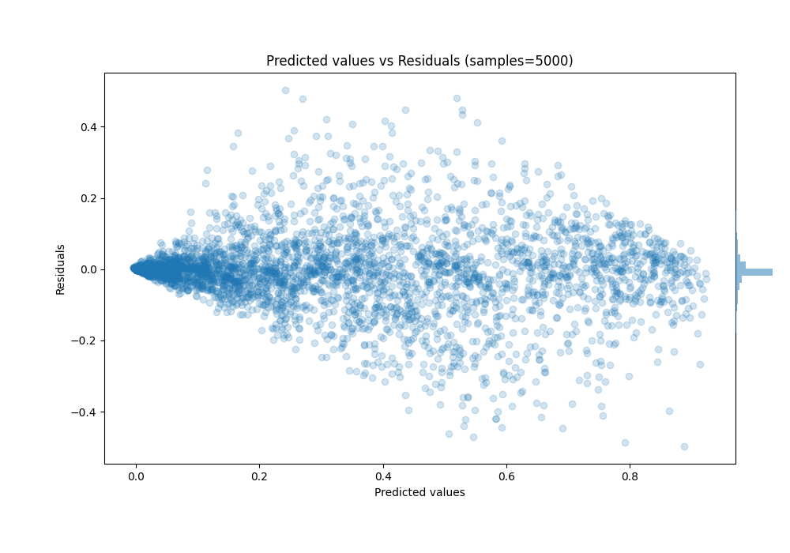

# Summary of Ensemble

[<< Go back](../README.md)

## Ensemble structure
| Model                     |   Weight |
|:--------------------------|---------:|
| 11_CatBoost               |        2 |
| 12_CatBoost               |        2 |
| 15_CatBoost               |        3 |
| 4_CatBoost_KMeansFeatures |       10 |
| 7_CatBoost                |        2 |
| 8_CatBoost                |        2 |
| 9_CatBoost                |        1 |

### Metric details:
| Metric   |       Score |
|:---------|------------:|
| MAE      | 0.0500486   |
| MSE      | 0.00788888  |
| RMSE     | 0.0888194   |
| R2       | 0.893995    |
| MAPE     | 7.30012e+11 |

## Learning curves

## True vs Predicted

## Predicted vs Residuals

[<< Go back](../README.md)
