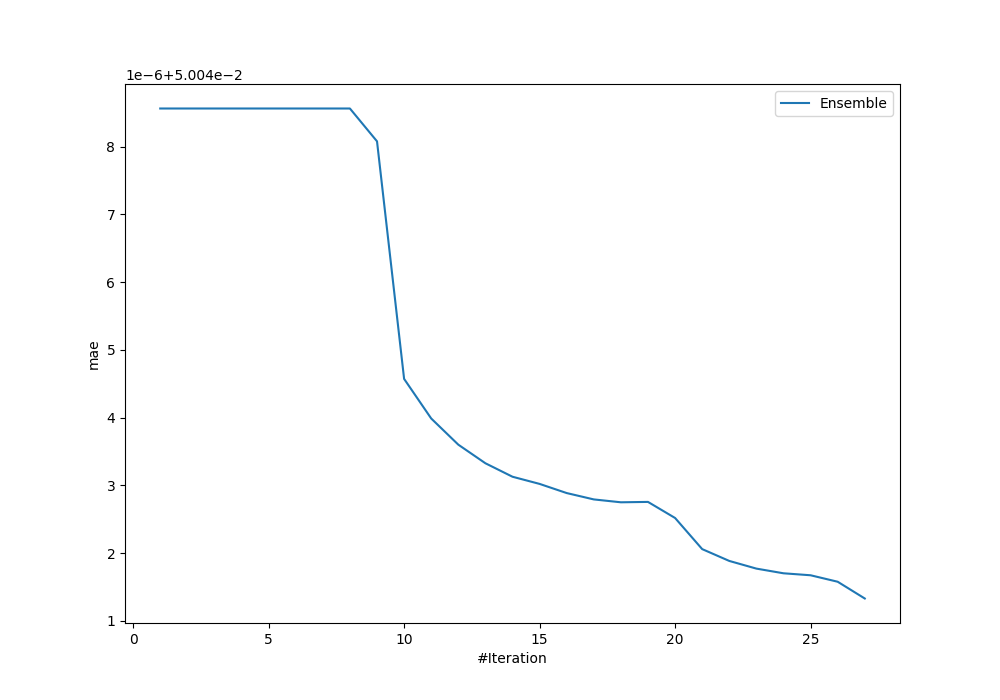
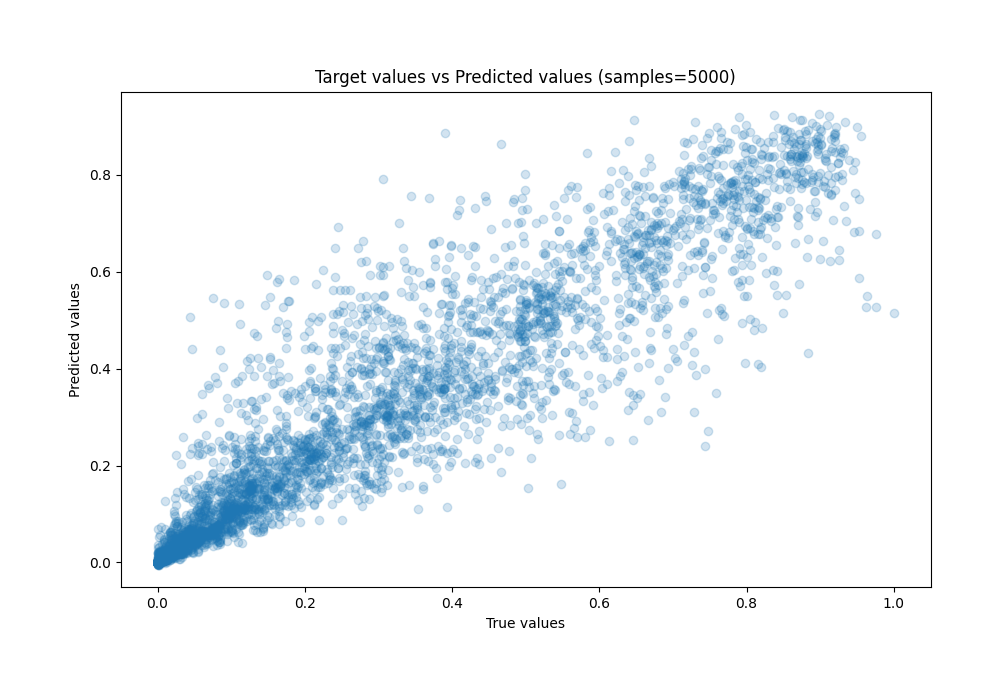
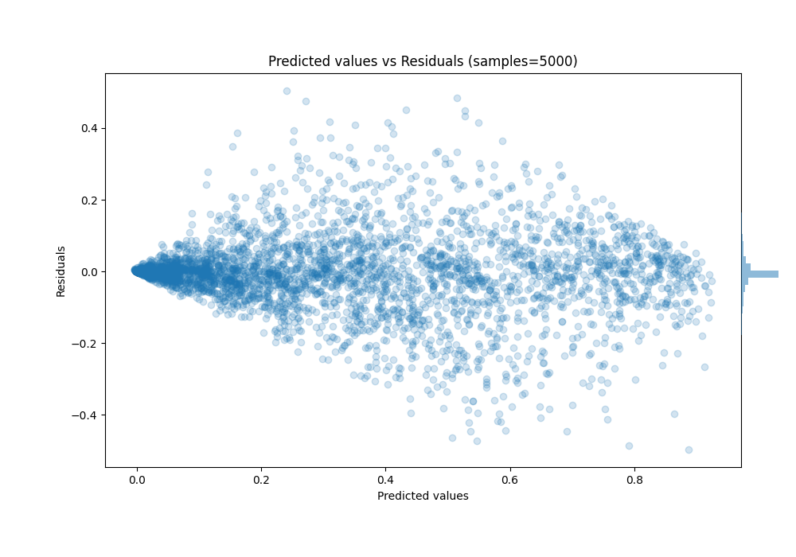

# Summary of Ensemble_Stacked

[<< Go back](../README.md)

## Ensemble structure
| Model                     |   Weight |
|:--------------------------|---------:|
| 11_CatBoost               |        1 |
| 12_CatBoost_Stacked       |        2 |
| 4_CatBoost_KMeansFeatures |        4 |
| 7_CatBoost_KMeansFeatures |        1 |
| Ensemble                  |       19 |

### Metric details:
| Metric   |       Score |
|:---------|------------:|
| MAE      | 0.0500413   |
| MSE      | 0.00789498  |
| RMSE     | 0.0888537   |
| R2       | 0.893913    |
| MAPE     | 7.06497e+11 |

## Learning curves

## True vs Predicted

## Predicted vs Residuals

[<< Go back](../README.md)
