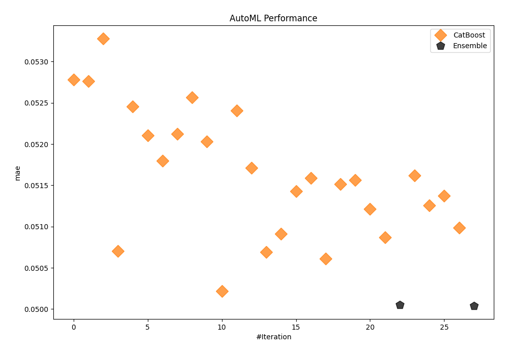
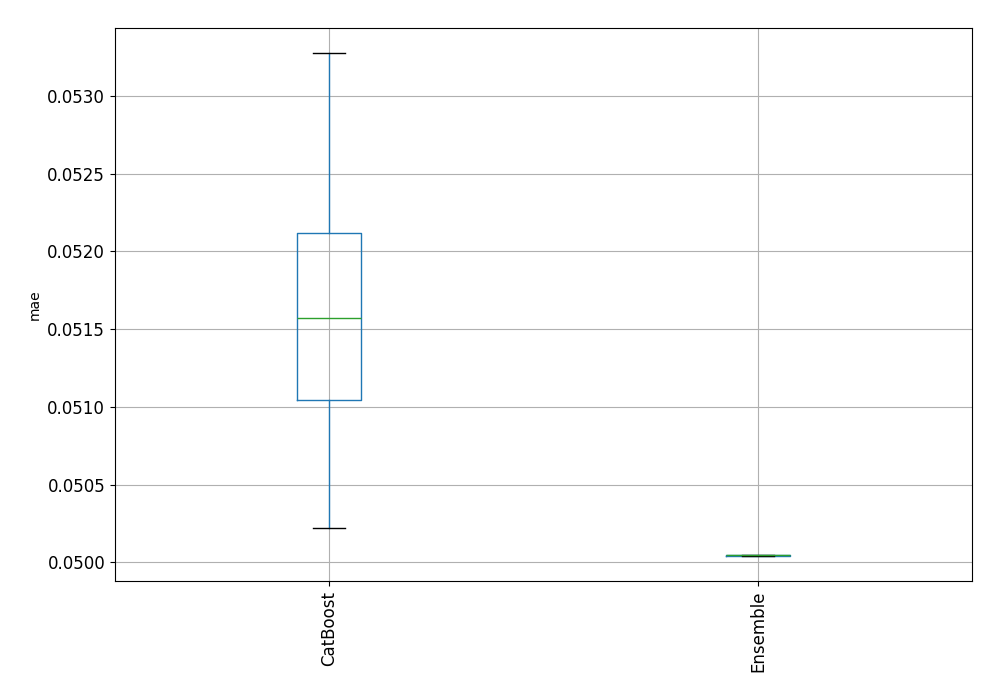
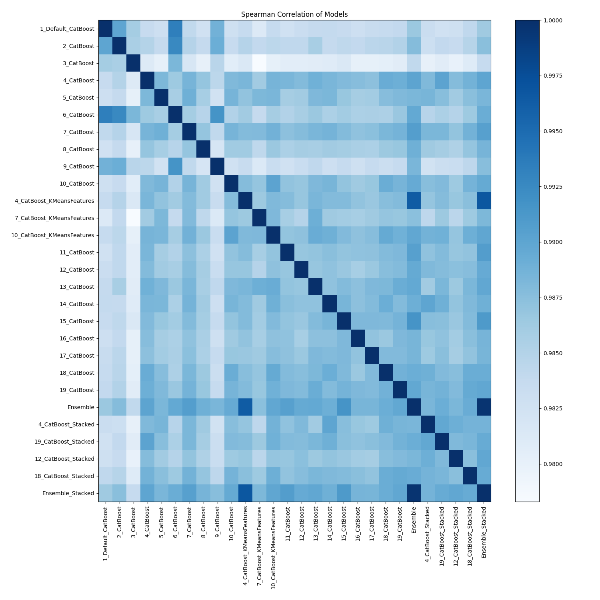

# AutoML Leaderboard

| Best model   | name                                                               | model_type   | metric_type   |   metric_value |   train_time |
|:-------------|:-------------------------------------------------------------------|:-------------|:--------------|---------------:|-------------:|
|              | [1_Default_CatBoost](1_Default_CatBoost/README.md)                 | CatBoost     | mae           |      0.0527825 |        13.68 |
|              | [2_CatBoost](2_CatBoost/README.md)                                 | CatBoost     | mae           |      0.0527649 |        25.67 |
|              | [3_CatBoost](3_CatBoost/README.md)                                 | CatBoost     | mae           |      0.0532766 |        13.83 |
|              | [4_CatBoost](4_CatBoost/README.md)                                 | CatBoost     | mae           |      0.0507008 |       258.06 |
|              | [5_CatBoost](5_CatBoost/README.md)                                 | CatBoost     | mae           |      0.0524563 |        17.7  |
|              | [6_CatBoost](6_CatBoost/README.md)                                 | CatBoost     | mae           |      0.0521026 |        56.71 |
|              | [7_CatBoost](7_CatBoost/README.md)                                 | CatBoost     | mae           |      0.0518    |        38.36 |
|              | [8_CatBoost](8_CatBoost/README.md)                                 | CatBoost     | mae           |      0.0521236 |        22.96 |
|              | [9_CatBoost](9_CatBoost/README.md)                                 | CatBoost     | mae           |      0.0525636 |        21.67 |
|              | [10_CatBoost](10_CatBoost/README.md)                               | CatBoost     | mae           |      0.0520308 |        52.62 |
|              | [4_CatBoost_KMeansFeatures](4_CatBoost_KMeansFeatures/README.md)   | CatBoost     | mae           |      0.0502187 |       363.94 |
|              | [7_CatBoost_KMeansFeatures](7_CatBoost_KMeansFeatures/README.md)   | CatBoost     | mae           |      0.0524045 |        29.92 |
|              | [10_CatBoost_KMeansFeatures](10_CatBoost_KMeansFeatures/README.md) | CatBoost     | mae           |      0.0517138 |        70.3  |
|              | [11_CatBoost](11_CatBoost/README.md)                               | CatBoost     | mae           |      0.0506911 |       158.83 |
|              | [12_CatBoost](12_CatBoost/README.md)                               | CatBoost     | mae           |      0.0509137 |       153.18 |
|              | [13_CatBoost](13_CatBoost/README.md)                               | CatBoost     | mae           |      0.051427  |        43.46 |
|              | [14_CatBoost](14_CatBoost/README.md)                               | CatBoost     | mae           |      0.0515863 |       211.22 |
|              | [15_CatBoost](15_CatBoost/README.md)                               | CatBoost     | mae           |      0.0506113 |       209.16 |
|              | [16_CatBoost](16_CatBoost/README.md)                               | CatBoost     | mae           |      0.0515149 |       157.84 |
|              | [17_CatBoost](17_CatBoost/README.md)                               | CatBoost     | mae           |      0.0515625 |        83.46 |
|              | [18_CatBoost](18_CatBoost/README.md)                               | CatBoost     | mae           |      0.0512121 |       173.54 |
|              | [19_CatBoost](19_CatBoost/README.md)                               | CatBoost     | mae           |      0.0508687 |       144.7  |
|              | [Ensemble](Ensemble/README.md)                                     | Ensemble     | mae           |      0.0500486 |         0.94 |
|              | [4_CatBoost_Stacked](4_CatBoost_Stacked/README.md)                 | CatBoost     | mae           |      0.0516178 |       128.37 |
|              | [19_CatBoost_Stacked](19_CatBoost_Stacked/README.md)               | CatBoost     | mae           |      0.0512566 |        85.36 |
|              | [12_CatBoost_Stacked](12_CatBoost_Stacked/README.md)               | CatBoost     | mae           |      0.0513743 |       126.73 |
|              | [18_CatBoost_Stacked](18_CatBoost_Stacked/README.md)               | CatBoost     | mae           |      0.0509875 |       227.9  |
| **the best** | [Ensemble_Stacked](Ensemble_Stacked/README.md)                     | Ensemble     | mae           |      0.0500413 |         1.36 |

### AutoML Performance

### AutoML Performance Boxplot

### Spearman Correlation of Models

