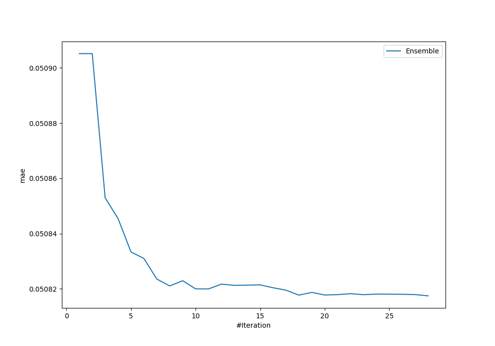

# Summary of Ensemble_Stacked

[<< Go back](../README.md)

## Ensemble structure
| Model                             |   Weight |
|:----------------------------------|---------:|
| 14_Xgboost_Stacked                |        3 |
| 15_Xgboost                        |        2 |
| 2_Xgboost                         |        1 |
| 4_Xgboost_Stacked                 |        5 |
| 4_Xgboost_categorical_mix_Stacked |        3 |
| Ensemble                          |       14 |

### Metric details:
| Metric   |      Score |
|:---------|-----------:|
| MAE      | 0.0508174  |
| MSE      | 0.00806571 |
| RMSE     | 0.0898093  |
| R2       | 0.891619   |
| MAPE     | 8.7819e+11 |

## Learning curves

## True vs Predicted

## Predicted vs Residuals

[<< Go back](../README.md)
