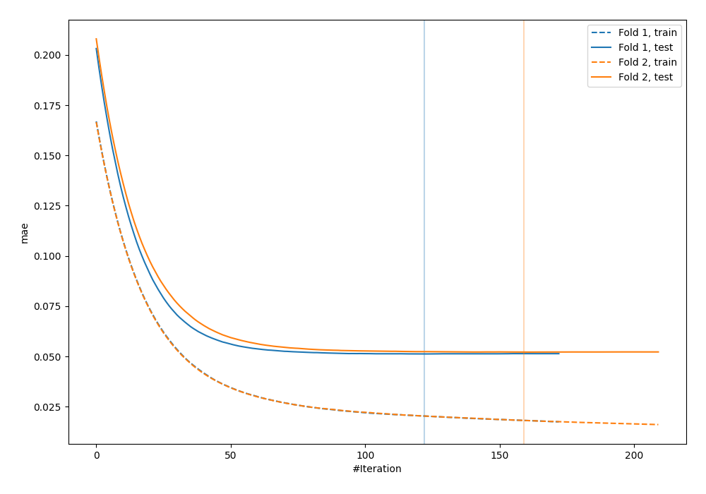
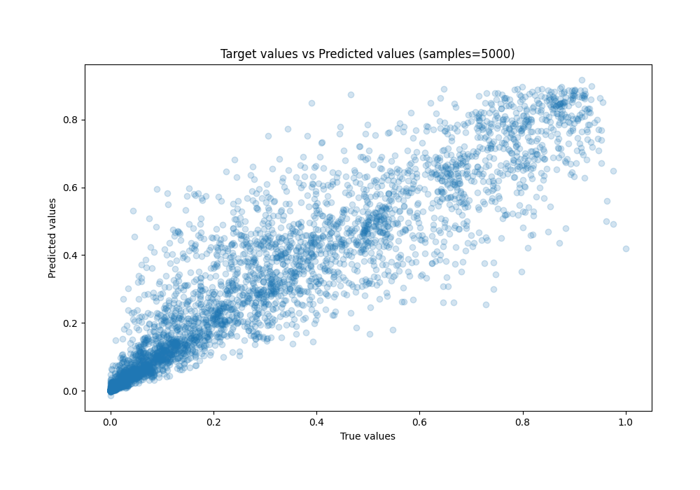
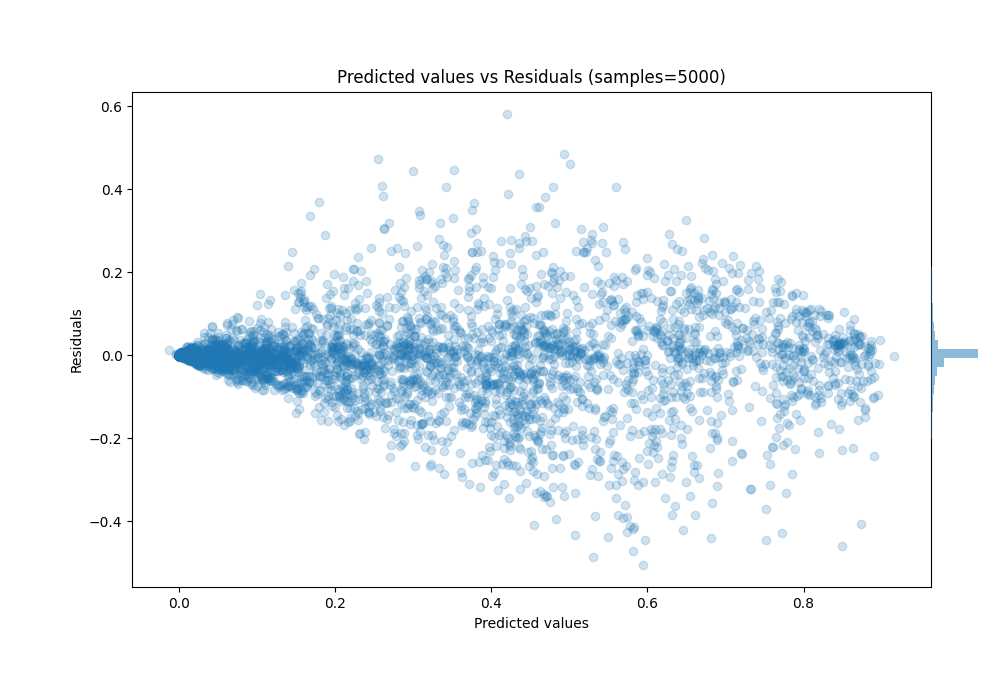

# Summary of 4_Xgboost_categorical_mix_KMeansFeatures

[<< Go back](../README.md)

## Extreme Gradient Boosting (Xgboost)
- **n_jobs**: -1
- **objective**: reg:squarederror
- **eta**: 0.05
- **max_depth**: 9
- **min_child_weight**: 10
- **subsample**: 0.8
- **colsample_bytree**: 0.6
- **eval_metric**: mae
- **explain_level**: 0

## Validation
 - **validation_type**: custom

## Optimized metric
mae

## Training time

19.4 seconds

### Metric details:
| Metric   |       Score |
|:---------|------------:|
| MAE      | 0.05169     |
| MSE      | 0.00836819  |
| RMSE     | 0.0914778   |
| R2       | 0.887554    |
| MAPE     | 8.48549e+11 |

## Learning curves

## True vs Predicted

## Predicted vs Residuals

[<< Go back](../README.md)
