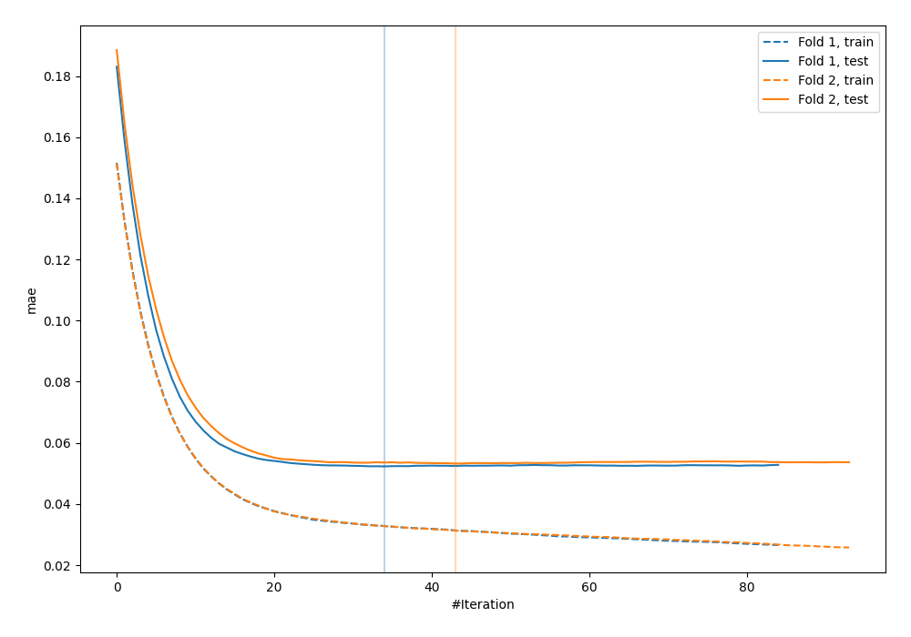
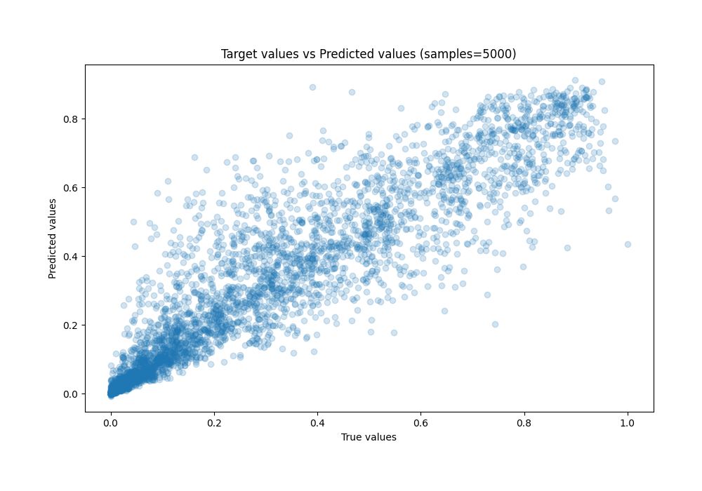
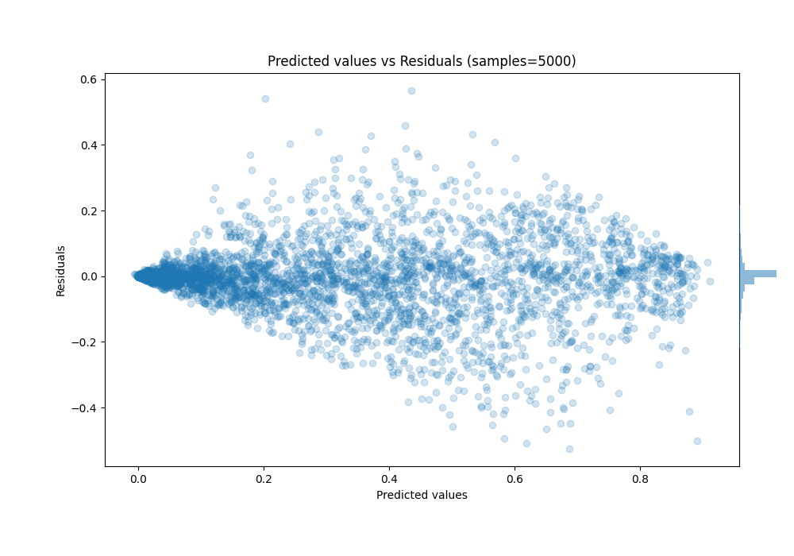

# Summary of 8_Xgboost

[<< Go back](../README.md)

## Extreme Gradient Boosting (Xgboost)
- **n_jobs**: -1
- **objective**: reg:squarederror
- **eta**: 0.15
- **max_depth**: 7
- **min_child_weight**: 25
- **subsample**: 0.6
- **colsample_bytree**: 1.0
- **eval_metric**: mae
- **explain_level**: 0

## Validation
 - **validation_type**: custom

## Optimized metric
mae

## Training time

7.2 seconds

### Metric details:
| Metric   |       Score |
|:---------|------------:|
| MAE      | 0.05276     |
| MSE      | 0.00850141  |
| RMSE     | 0.0922031   |
| R2       | 0.885764    |
| MAPE     | 1.35424e+12 |

## Learning curves

## True vs Predicted

## Predicted vs Residuals

[<< Go back](../README.md)
