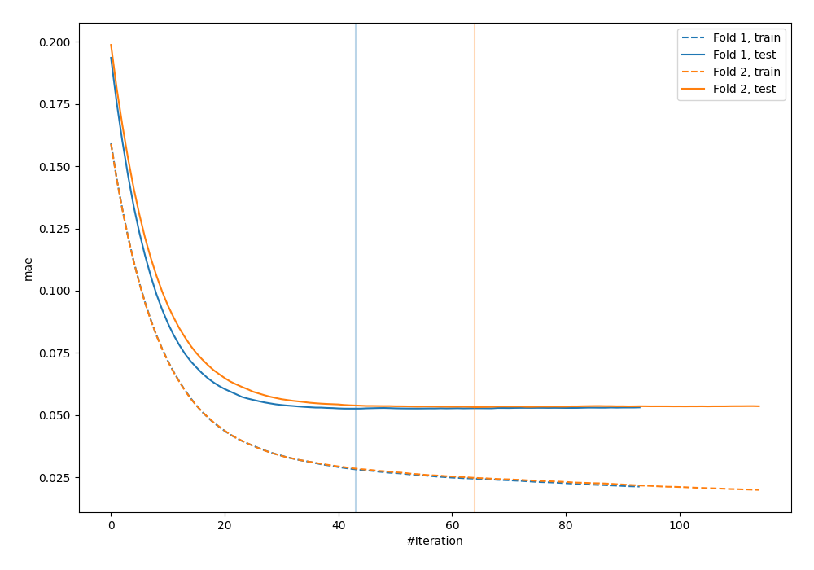
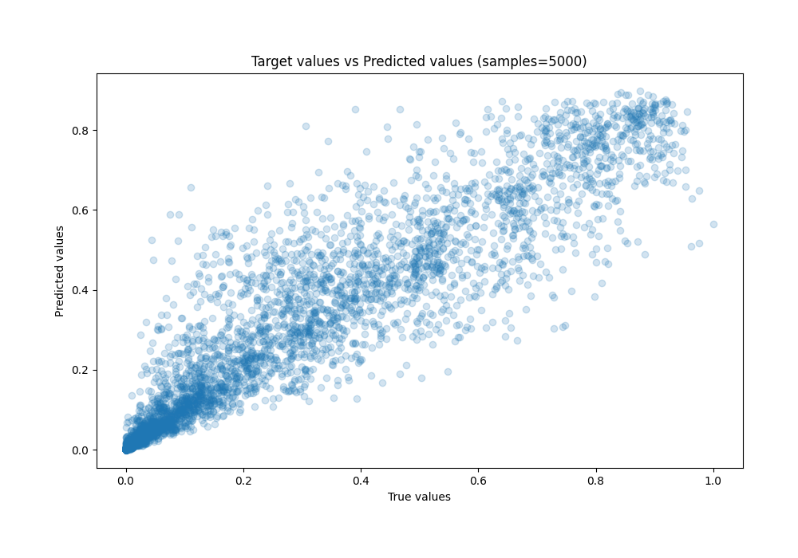
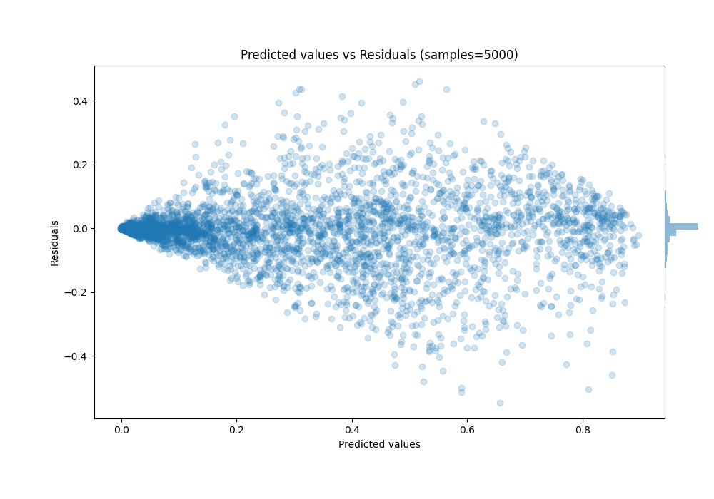

# Summary of 9_Xgboost

[<< Go back](../README.md)

## Extreme Gradient Boosting (Xgboost)
- **n_jobs**: -1
- **objective**: reg:squarederror
- **eta**: 0.1
- **max_depth**: 8
- **min_child_weight**: 1
- **subsample**: 0.6
- **colsample_bytree**: 0.5
- **eval_metric**: mae
- **explain_level**: 0

## Validation
 - **validation_type**: custom

## Optimized metric
mae

## Training time

9.7 seconds

### Metric details:
| Metric   |      Score |
|:---------|-----------:|
| MAE      | 0.0528989  |
| MSE      | 0.00845697 |
| RMSE     | 0.0919618  |
| R2       | 0.886361   |
| MAPE     | 1.6295e+12 |

## Learning curves

## True vs Predicted

## Predicted vs Residuals

[<< Go back](../README.md)
