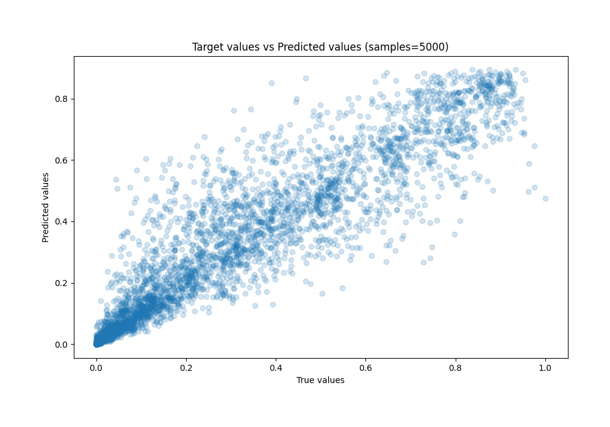

# Summary of Ensemble

[<< Go back](../README.md)

## Ensemble structure
| Model                    |   Weight |
|:-------------------------|---------:|
| 15_Xgboost               |        3 |
| 16_Xgboost               |        5 |
| 2_Xgboost                |        2 |
| 3_Xgboost                |        2 |
| 4_Xgboost                |        2 |
| 4_Xgboost_KMeansFeatures |        3 |

### Metric details:
| Metric   |       Score |
|:---------|------------:|
| MAE      | 0.0509052   |
| MSE      | 0.00804369  |
| RMSE     | 0.0896866   |
| R2       | 0.891914    |
| MAPE     | 9.15762e+11 |

## Learning curves

## True vs Predicted

## Predicted vs Residuals

[<< Go back](../README.md)
