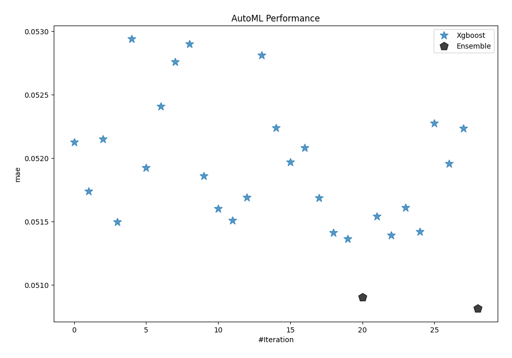
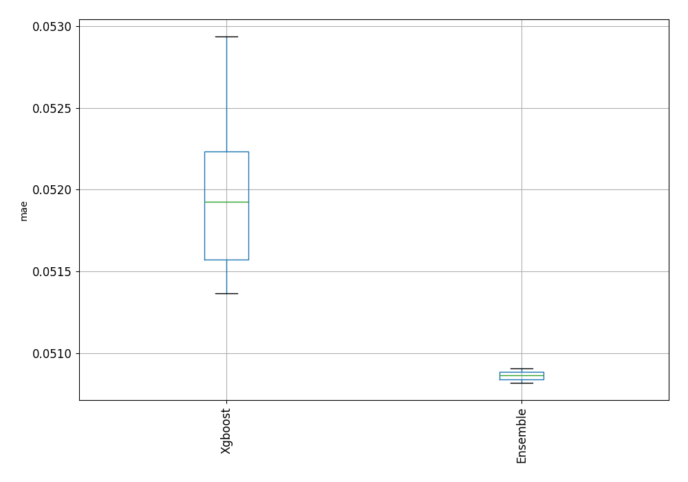
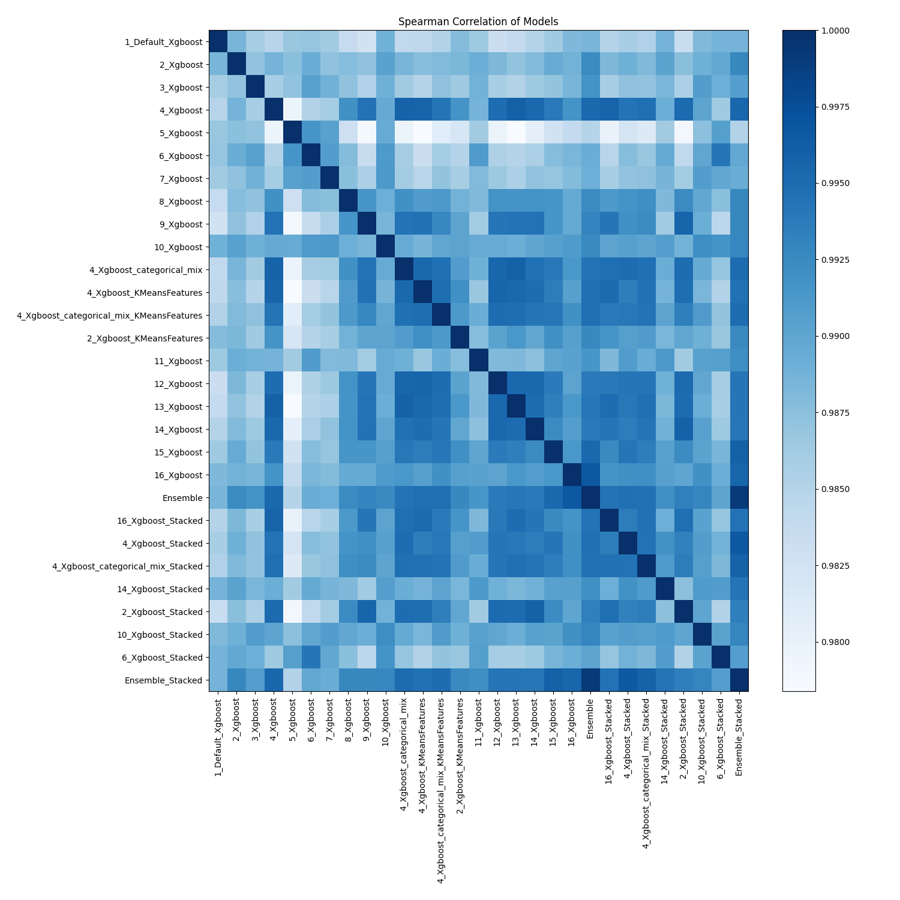

# AutoML Leaderboard

| Best model   | name                                                                                           | model_type   | metric_type   |   metric_value |   train_time |
|:-------------|:-----------------------------------------------------------------------------------------------|:-------------|:--------------|---------------:|-------------:|
|              | [1_Default_Xgboost](1_Default_Xgboost/README.md)                                               | Xgboost      | mae           |      0.0521272 |        11.21 |
|              | [2_Xgboost](2_Xgboost/README.md)                                                               | Xgboost      | mae           |      0.0517387 |         8.58 |
|              | [3_Xgboost](3_Xgboost/README.md)                                                               | Xgboost      | mae           |      0.0521493 |         6.15 |
|              | [4_Xgboost](4_Xgboost/README.md)                                                               | Xgboost      | mae           |      0.0514983 |        17.68 |
|              | [5_Xgboost](5_Xgboost/README.md)                                                               | Xgboost      | mae           |      0.0529387 |         6.29 |
|              | [6_Xgboost](6_Xgboost/README.md)                                                               | Xgboost      | mae           |      0.0519259 |         8.85 |
|              | [7_Xgboost](7_Xgboost/README.md)                                                               | Xgboost      | mae           |      0.0524102 |         6.95 |
|              | [8_Xgboost](8_Xgboost/README.md)                                                               | Xgboost      | mae           |      0.05276   |         7.62 |
|              | [9_Xgboost](9_Xgboost/README.md)                                                               | Xgboost      | mae           |      0.0528989 |        10.06 |
|              | [10_Xgboost](10_Xgboost/README.md)                                                             | Xgboost      | mae           |      0.0518589 |         9.41 |
|              | [4_Xgboost_categorical_mix](4_Xgboost_categorical_mix/README.md)                               | Xgboost      | mae           |      0.0516032 |        14.78 |
|              | [4_Xgboost_KMeansFeatures](4_Xgboost_KMeansFeatures/README.md)                                 | Xgboost      | mae           |      0.0515099 |        22.8  |
|              | [4_Xgboost_categorical_mix_KMeansFeatures](4_Xgboost_categorical_mix_KMeansFeatures/README.md) | Xgboost      | mae           |      0.05169   |        19.76 |
|              | [2_Xgboost_KMeansFeatures](2_Xgboost_KMeansFeatures/README.md)                                 | Xgboost      | mae           |      0.0528124 |        11.44 |
|              | [11_Xgboost](11_Xgboost/README.md)                                                             | Xgboost      | mae           |      0.0522383 |        13.97 |
|              | [12_Xgboost](12_Xgboost/README.md)                                                             | Xgboost      | mae           |      0.0519679 |        17.32 |
|              | [13_Xgboost](13_Xgboost/README.md)                                                             | Xgboost      | mae           |      0.0520808 |        11.21 |
|              | [14_Xgboost](14_Xgboost/README.md)                                                             | Xgboost      | mae           |      0.0516881 |        14.33 |
|              | [15_Xgboost](15_Xgboost/README.md)                                                             | Xgboost      | mae           |      0.0514143 |        18.11 |
|              | [16_Xgboost](16_Xgboost/README.md)                                                             | Xgboost      | mae           |      0.0513647 |        12.99 |
|              | [Ensemble](Ensemble/README.md)                                                                 | Ensemble     | mae           |      0.0509052 |         0.82 |
|              | [16_Xgboost_Stacked](16_Xgboost_Stacked/README.md)                                             | Xgboost      | mae           |      0.0515399 |        13.05 |
|              | [4_Xgboost_Stacked](4_Xgboost_Stacked/README.md)                                               | Xgboost      | mae           |      0.0513927 |        19.32 |
|              | [4_Xgboost_categorical_mix_Stacked](4_Xgboost_categorical_mix_Stacked/README.md)               | Xgboost      | mae           |      0.0516109 |        16.95 |
|              | [14_Xgboost_Stacked](14_Xgboost_Stacked/README.md)                                             | Xgboost      | mae           |      0.0514198 |        16.88 |
|              | [2_Xgboost_Stacked](2_Xgboost_Stacked/README.md)                                               | Xgboost      | mae           |      0.0522738 |         9.34 |
|              | [10_Xgboost_Stacked](10_Xgboost_Stacked/README.md)                                             | Xgboost      | mae           |      0.0519554 |        10.6  |
|              | [6_Xgboost_Stacked](6_Xgboost_Stacked/README.md)                                               | Xgboost      | mae           |      0.0522332 |        10.02 |
| **the best** | [Ensemble_Stacked](Ensemble_Stacked/README.md)                                                 | Ensemble     | mae           |      0.0508174 |         1.45 |

### AutoML Performance

### AutoML Performance Boxplot

### Spearman Correlation of Models

